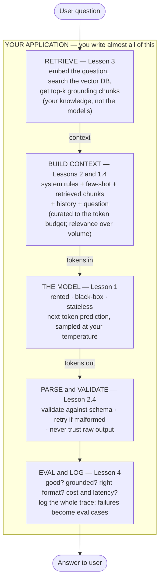

# AI Engineering — Phase 1 Course (Beginner Edition)

> From Magic to Mechanism.
> Four lessons. Teaching mode is gentle and explains every term. Drills are harsh.
> Assumes ~1 year of programming in any language — you can call an HTTP API and parse JSON. **Zero** machine-learning knowledge required.

---

## Prerequisites

You should be able to write a program that makes an HTTP request and reads the JSON that comes back. That's it. You do not need to know what a neural network is, what a gradient is, or any mathematics beyond "vectors are lists of numbers." This course teaches in prose, then tests you with deliberately harsh drills. Write and run your drill answers as you go.

## Before You Start: What AI Engineering Actually Is

There are two jobs people call "AI." They are almost entirely different.

The first is **machine-learning engineering** (or "training" / "research"): you have data, you have GPUs, and you *build* a model — you choose an architecture, run training, tune it, and out comes a set of weights. This is hard, expensive, and most people will never do it.

The second is **AI engineering**, which is what this course is about: you take a model **someone else already trained** — a "foundation model" like the ones behind ChatGPT, Claude, or Gemini — and you build a *product* on top of it. You did not train it. You cannot see inside it. You cannot change its weights. You rent it over an HTTP API and pay per word.

That sounds like a smaller job. It is not. The model is one black box in the middle of your system. **Everything else is yours**: deciding what text to send it, giving it the knowledge it lacks, parsing what it sends back, checking whether the answer is any good, keeping it fast and cheap, and stopping it from doing something stupid or dangerous. That "everything else" is a real engineering discipline, and almost nobody does it well, because it *feels* easy. You type a sentence, you get a paragraph back, the demo works, everyone claps. Then you put it in front of 10,000 real users and it falls apart in ways you've never debugged before, because the thing at the center is non-deterministic and confidently wrong a fraction of the time.

Phase 1 exists to teach you the **foundations**: what the model actually is (so you stop being surprised by it), how to talk to it like an engineer instead of a wizard, how to give it knowledge it doesn't have, and how to *measure* whether any of it works. Phase 2 builds production systems and agents on top of these foundations.

The mental shift you have to make: **you are not programming the model. You are programming the text that goes into it and the system that surrounds it.** The model is a probabilistic component, like a network call that sometimes lies. Your job is to build something reliable out of an unreliable part.

---

## A Small Glossary You'll See A Lot

I'll explain these properly as they come up, but bookmark this for quick reference:

- **Token** = the unit a model reads and writes. Roughly ¾ of an English word. Not a character, not a word. You are billed per token.
- **Context window** = the maximum number of tokens the model can "see" at once: your instructions + history + documents + its own answer. The model's entire working memory.
- **Foundation model / frontier model** = a large pretrained model (GPT, Claude, Gemini, etc.). "Frontier" = the current most-capable ones.
- **Inference** = running the model to get an output. (Training builds the model; inference uses it.)
- **Prompt** = the text you send the model.
- **System / user / assistant** = the three roles in a chat request. System = your standing instructions; user = the human's input; assistant = the model's replies.
- **Temperature** = a knob (0–~2) controlling randomness in the output. Lower = more predictable.
- **Embedding** = a list of numbers representing the *meaning* of a piece of text. Similar meanings → nearby numbers.
- **RAG** = Retrieval-Augmented Generation. Look up relevant text first, paste it into the prompt, then ask. How you give the model knowledge it wasn't trained on.
- **Hallucination** = the model stating something false with total confidence. Structural, not a bug (Lesson 1.7).
- **Eval** = an automated test of model output quality. The discipline that separates engineers from tinkerers (Lesson 4).
- **Fine-tuning** = continuing to train a model on your data to change its *behavior or style*. Not the right tool for adding *facts* (Lesson 3.6).
- **Prompt injection** = an attacker hiding instructions inside text the model reads, hijacking it. The SQL injection of LLMs (Lesson 2.7).
- **Latency** = how long a response takes. **TTFT** = time to first token (how long until words start appearing).
- **Token budget** = the fact that the context window is finite and every token costs money and competes for the model's attention.

---

# Lesson 1: What a Language Model Actually Is (Just Enough)

## 1.1 Why This Lesson Exists

In early 2023, a New York lawyer named Steven Schwartz filed a legal brief in federal court. He'd used ChatGPT to do the research. The brief cited half a dozen prior cases — with names, court records, and quotations — that supported his client beautifully. There was one problem: **the cases did not exist.** ChatGPT had invented them, complete with realistic-looking citations. The judge noticed, the lawyer was sanctioned, and the case (*Mata v. Avianca*) became the textbook example of what happens when you misunderstand the tool.

Schwartz's mistake was not laziness. It was a **mental model error**. He thought ChatGPT was a search engine — a thing that retrieves true facts. It is not. It is a thing that produces *plausible-sounding text*. Sometimes plausible text is true. Sometimes it isn't, and the model has no idea which is which, because **it was never built to know the difference.**

You cannot build reliable products on a component you fundamentally misunderstand. So before any prompting, retrieval, or evaluation, you need an honest, mechanical picture of what this thing is. Not the marketing version. The real one. That's this lesson.

## 1.2 The One Trick: Next-Token Prediction

Strip away every layer of polish and a language model does exactly one thing:

> Given a sequence of tokens, predict a probability distribution over what the next token should be.

That's the whole trick. Everything — chat, code, translation, "reasoning," poetry — emerges from doing this one thing, extremely well, at enormous scale.

Here's the mechanism. You give the model some text: `"The capital of France is"`. The model computes, for *every token in its vocabulary* (often ~100,000+ tokens), a probability that it comes next:

```
" Paris"      0.91
" the"        0.02
" located"    0.015
" a"          0.01
" Lyon"       0.004
...            (tens of thousands more, each tiny)
```

It picks one (we'll see how in 1.5), appends it, and **does the whole thing again** with the new, longer sequence. Then again. Then again. One token at a time, left to right. This loop is called **autoregressive generation**:

```
"The capital of France is"            -> " Paris"
"The capital of France is Paris"      -> "."
"The capital of France is Paris."     -> <stop>
```

That is the entire engine. A model writing a 500-word essay is doing this loop ~700 times, each step asking only "given everything so far, what's the most plausible next token?" It is not planning the essay. It has no outline. It is putting one foot in front of the other, very convincingly.

Internalize this, because it explains almost every weird behavior you'll meet:

- **Why it's fluent but sometimes wrong**: it optimizes for *plausible*, not *true*.
- **Why it can't easily "count" or do exact arithmetic**: those aren't about plausibility of the next token.
- **Why prompting works at all**: the words you put before influence the probability distribution of what comes after.

## 1.3 Tokens, Not Words

The model does not read words or characters. It reads **tokens** — chunks of text produced by a tokenizer using an algorithm (usually "byte-pair encoding") that splits common sequences into single tokens and rare ones into pieces.

Rough rules for English:

```
~1 token   ≈ ¾ of a word
~1,000 tokens ≈ 750 words ≈ 1.5 pages
```

But it's lumpy. Common words are one token (`" the"`, `" cat"`). Rare or compound words split (`"tokenization"` → `"token" + "ization"`). Whitespace and capitalization matter (`"cat"`, `" cat"`, and `"Cat"` can be different tokens). Numbers, code, and especially **non-English text** tokenize much worse — a sentence in English might be 10 tokens and the same sentence in Thai or Chinese 40, which means non-English users pay more and hit context limits sooner.

Why you, an engineer, must care:

1. **You are billed per token**, input and output. Cost is a token-counting problem (Lesson 4.5, and all of 102).
2. **The context window is measured in tokens**, not characters or words (1.4).
3. **Tokenization explains a famous failure.** Ask a model "how many R's are in *strawberry*?" and older models often said two. Not because they're dumb — because they never saw the letters. They saw the tokens `straw` + `berry`, and the individual characters inside a token are not directly visible to the model. It's reasoning about chunks, not spelling.

Practical move: use your provider's tokenizer library to count tokens *before* you send a request, especially when you're stuffing documents into a prompt. "It's about 4 pages" is not a number you can budget with. "3,900 tokens" is.

## 1.4 The Context Window Is the Only Memory

This is the single most important thing to understand about building with these models, and the thing beginners get wrong most often.

**The model has no memory. The API is stateless.**

When you have a "conversation" with a chatbot, it feels like the model remembers what you said three messages ago. It does not. What actually happens: every time you send a message, **the entire conversation so far is re-sent to the model as input.** The model reads the whole history fresh, every single time, generates the next reply, and then forgets everything. The "memory" is an illusion created by your application resending the transcript.

```
Turn 1 you send:  [system] [user: "Hi, I'm Hinson"]
                  model replies: "Hello Hinson!"

Turn 2 you send:  [system] [user: "Hi, I'm Hinson"]
                  [assistant: "Hello Hinson!"] [user: "What's my name?"]
                  model replies: "Your name is Hinson."
                  ^ It only knew because you resent the whole transcript.
```

Everything the model can use to answer — your instructions, the conversation, any documents you pasted in, and the answer it's currently writing — must fit inside one finite budget called the **context window**, measured in tokens.

How big is it? As of 2026, frontier models commonly advertise context windows around **one million tokens** (roughly a 750,000-word book), up from ~4,000 tokens just a few years earlier. That sounds like infinity. It is not, for two reasons:

1. **It's still a budget.** A million tokens of input on a frontier model can cost real money *per request*, and long conversations or document dumps fill it faster than you'd think.
2. **"Supports" ≠ "performs."** Models reliably *retrieve* a single fact from anywhere in a huge window, but their quality at *reasoning across* a full window degrades, and there's a well-documented effect — **"lost in the middle"** (Liu et al., 2023) — where information at the start and end of the context is used well and information buried in the middle is used poorly. Cramming everything into a giant context and hoping is not a strategy. *Curating* the context is the strategy (this is the heart of Phase 2).

Mental model: **the context window is the model's RAM, and you are its memory manager.** That framing will carry you through this whole field.

## 1.5 Sampling: Where the Randomness Comes From

In 1.2 the model produced a probability distribution over next tokens. How does it pick one? That choice is **sampling**, and it's where the randomness — the reason the same prompt gives different answers — comes from.

- **Temperature** reshapes the distribution before picking. At **temperature 0**, the model (near-)always takes the single highest-probability token — "greedy," most predictable. As temperature rises (0.7, 1.0, 1.5…), lower-probability tokens get more chance, so output gets more varied and "creative" — and more prone to going off the rails.
- **Top-p (nucleus sampling)** restricts the pick to the smallest set of tokens whose probabilities sum to *p* (e.g. 0.9), cutting off the long tail of unlikely garbage.

Two consequences you must design around:

1. **For anything you'll parse or anything factual** (classification, extraction, structured output), use **low temperature**. You want boring and repeatable.
2. **Low temperature is not a guarantee of identical output.** Even at temperature 0, you can get different results across runs because of hardware/floating-point non-determinism on the provider's side. This breaks naive testing — you cannot assert `output == "expected string"`. (This is *why* Lesson 4 exists. Hold that thought.)

## 1.6 What the Model Does *Not* Have

A list to tape to your monitor. By default, out of the box, the model has:

- **No memory** between API calls (1.4). State lives in your app.
- **No access to the internet, your database, your files, or a clock.** It cannot look anything up or take any action. It only emits text. (Giving it the *ability* to act is tool use — Phase 2, Lesson 1.)
- **No knowledge after its training cutoff.** Ask about something that happened after it was trained and it will either say it doesn't know or — worse — confidently make something up.
- **No notion of "true."** It has plausibility, not truth. It does not have a fact-checker inside it.
- **No reliable self-knowledge.** "Are you sure?" is not a fact check; it's another prompt that nudges the distribution. A model saying "I'm confident" is not evidence of anything.

Every one of these gaps is a *job for you*. The entire field of AI engineering is, in a sense, the discipline of compensating for this list.

## 1.7 Why Hallucination Is Structural, Not a Bug

Put 1.2 and 1.6 together and you arrive at the most important truth in this course.

The model always outputs the **most plausible continuation** of the text so far. It does this whether or not a true answer exists in its weights. When you ask for a citation, the *shape* of a citation is highly plausible — author, year, court, page number — so it produces a perfectly-shaped citation. Whether that citation corresponds to a real case is a question the model is not equipped to ask. It generated *plausible text*, which is the only thing it does.

This is **hallucination**, and it is not a glitch that a future patch will remove. It is the direct, inevitable consequence of how the thing works. A model is, in the precise technical sense, a *fluent bullshitter*: it produces text optimized to sound right, indifferent to whether it is right. Most of the time the most plausible text *is* true, which is why these models are useful. But the failure mode is built into the mechanism.

The engineering implications — which the rest of this course operationalizes — are:

1. **Never trust a factual claim from the model that you can't ground or verify.** (→ Retrieval, Lesson 3.)
2. **Constrain and structure outputs** so there's less room to invent. (→ Prompting, Lesson 2.)
3. **Measure how often it's wrong, on your actual task.** (→ Evals, Lesson 4.)

The lawyer in 1.1 didn't get unlucky. He used a plausibility engine as a truth engine. Don't build a product that does the same.

## 1.8 Summary: The Rules

1. **The model predicts the next token, one at a time.** Everything else is emergent. Fluency is the product; truth is incidental.
2. **It reads tokens, not words or characters.** ~¾ word each; non-English costs more; spelling tasks are hard for mechanical reasons.
3. **The API is stateless; the context window is the only memory.** Your app resends the transcript every turn. You are the memory manager.
4. **Bigger context ≠ uniformly used context.** "Lost in the middle" is real. Curate, don't dump.
5. **Output is sampled.** Temperature controls randomness. Low temp for anything parsed or factual — but never assume byte-identical output.
6. **The model has no memory, tools, clock, internet, or notion of truth by default.** Each gap is your job.
7. **Hallucination is structural.** Plan for it with grounding, constraints, and evals. Do not expect it to be patched away.

## 1.9 Drill 1

Rules: show mechanism, not vibes. "It just knows stuff" gets zero credit. Explain what the model is actually doing at the token level. Reply with your answers and I'll tear them apart.

**Q1. Mechanism.**

In your own words, explain why a language model can produce a fluent, well-formatted, completely fake academic citation. Don't say "it hallucinates." Say *why*, in terms of next-token prediction and what "plausible" means. You should be able to write at least 150 words and mention: what the model is optimizing for at each token, why the *shape* of a citation is easy to produce, and why the *truth* of it is not something the mechanism checks.

**Q2. The stateless conversation.**

A junior engineer says: "I'll save tokens by only sending the user's newest message each turn, since the model already remembers the earlier ones." Explain exactly what will go wrong, why, and what the model will and won't be able to do in turn 5. Then describe the actual data your application must store and resend, and where the cost comes from.

**Q3. Token reasoning.**

Without running a tokenizer, predict (roughly) which of these is *most* tokens and which is *fewest*, and justify each with a rule from 1.3:
- (a) `"The cat sat on the mat."`
- (b) `"Anthropization deinstitutionalization"`
- (c) the same English sentence as (a), translated into a non-Latin-script language you know
- (d) `"1234567890"`

Then explain, mechanically, why "how many double-letters are in *bookkeeper*?" is a hard question for the model in a way that "summarize this paragraph" is not.

**Q4. Temperature decision.**

For each task, choose a temperature (give a number) and justify it in one sentence using 1.5:
- (a) Extracting an invoice total into JSON.
- (b) Brainstorming 20 product-name ideas.
- (c) Classifying a support ticket as `billing | technical | other`.
- (d) Writing marketing copy variations to A/B test.

Then: a teammate sets temperature 0 and writes a test asserting `assert output == "Total: $42.00"`. Explain why this test will flake, and what they should assert instead. (You don't have to solve it fully — that's Lesson 4.)

**Q5. Draw the boundary.**

For each capability, state whether a bare foundation model has it out of the box (yes/no) and, if no, name the Phase-1-or-2 technique that provides it:
- (a) Tell you today's date.
- (b) Look up your company's refund policy.
- (c) Remember your name across a long chat.
- (d) Send an email.
- (e) Translate a paragraph.
- (f) Tell you whether its own answer is factually correct.

**Q6. Reading.**

Read Stephen Wolfram's essay "What Is ChatGPT Doing … and Why Does It Work?" (free online) — at least the sections on next-token prediction and temperature. Also skim the abstract and figure 1 of Liu et al., "Lost in the Middle: How Language Models Use Long Contexts" (2023).

After reading, answer:
- In Wolfram's framing, what does the model produce at each step, and what role does temperature play in turning that into text?
- What did the "lost in the middle" experiments vary, and what was the shape of the resulting accuracy curve?
- Why does this curve mean that "just use a model with a bigger context window" is an incomplete answer to "how do I give the model a lot of information"?

---

# Lesson 2: Prompting Is Engineering, Not Incantation

## 2.1 Why This Lesson Exists

The internet is full of "prompt magic": secret phrases, "you are a world-class expert," "I'll tip you $200," "take a deep breath." Some of these nudge outputs a little. None of them are engineering, because **none of them are reliable, and you can't tell which ones help without measuring.**

Here's the trap that catches every team. You write a prompt. You try it five times. It works. You ship it. Now it runs ten thousand times a day against inputs you never imagined, and it fails on 4% of them in ways you've never seen — empty answers, the wrong format that crashes your parser, a refusal, a confidently wrong number. A demo is five hand-picked inputs. A product is the long tail of weird real inputs. The gap between them is where prompting-as-engineering lives.

This lesson treats a prompt as what it actually is: **a specification for a non-deterministic component.** You write it precisely, you structure its output so you can parse it safely, and you stay alert to the fact that any text in the window — including text from your own database — can carry instructions.

## 2.2 The Anatomy of a Request: Roles

A chat request is not one blob of text. It's a list of messages, each with a **role**:

```
system:    "You are a support assistant for an order-book DEX.
            Answer only from the provided docs. If the answer
            isn't there, say you don't know. Be concise."
user:      "Why was my limit order rejected?"
assistant: (the model writes this)
```

- **system** — your standing instructions and constraints. Set the rules here: who the model is, what it may and may not do, the output format, the tone. This is the closest thing you have to "programming" the model's behavior.
- **user** — the human's input (and, in tool-using systems, results coming back).
- **assistant** — the model's turns. In multi-turn chat you include previous assistant turns so the model sees its own history (remember 1.4 — you're resending it).

Keep stable rules in `system`, the variable request in `user`. Don't bury your one hard constraint in the middle of a wall of user text where it can get lost.

## 2.3 Instructions Beat Incantations

The reliable lever is **specificity**, not magic words. The model fills ambiguity with whatever's most plausible, which may not be what you wanted. Pin it down.

Weak prompt:

```
Summarize this.
```

Specific prompt:

```
Summarize the text below for a busy executive.
- 3 bullet points, max 15 words each.
- Lead with the financial impact.
- Plain language, no jargon.
- If a number appears, keep it exact.

Text:
"""
{document}
"""
```

Notice the moves: a clear **task**, explicit **constraints** (length, count, format), the **audience**, an edge-case rule ("keep numbers exact"), and **delimiters** (`"""`) separating instructions from data so the model knows where each begins.

**Few-shot prompting** — showing 2–5 examples of input→output — is the highest-leverage technique when you need a specific format or judgment the model keeps getting subtly wrong. Examples communicate what instructions struggle to:

```
Classify the sentiment as positive, negative, or neutral.

Input: "shipping was late but product is great" -> mixed-leaning-positive
Input: "exactly what I expected"                -> neutral
Input: "stopped working after a day"            -> negative
Input: "{the real one}" ->
```

(One example is "one-shot," several is "few-shot," none is "zero-shot." Reach for few-shot the moment the task has a non-obvious shape.)

## 2.4 Structured Output: Getting JSON You Can Actually Parse

Most real systems don't want prose — they want **data** to put in a database or pass to another function. So you ask the model for JSON. The naive version is a trap:

```
Give me the name and total as JSON.
```

…and the model helpfully replies:

```
Sure! Here's the JSON you asked for:
```json
{"name": "Hinson", "total": 42}
```
Let me know if you need anything else!
```

Your `JSON.parse()` just choked on "Sure! Here's…". Rules for structured output:

1. **Use the provider's structured-output / JSON mode / tool-calling feature** when available — it constrains the model to emit valid JSON matching a schema you supply. This is far more reliable than asking nicely.
2. **If you must do it via prompt**, say "Respond with *only* the JSON object, no prose, no markdown fences," give the exact schema, and give an example.
3. **Always validate** the parsed result against a schema (types, required fields, allowed enum values). The model can return valid JSON that's semantically wrong.
4. **Never parse free text with a regex and hope.** Constrain at generation time; validate at parse time; have a retry path for when it's malformed.

Treat the model like an external service returning untrusted, occasionally-malformed data — because that's exactly what it is.

## 2.5 Decomposition and Reasoning

Recall 1.2: the model generates left to right with no plan. A direct demand for a hard answer forces it to commit to the first token of the answer before it has "thought." So it helps to make the thinking happen *in the tokens*.

**Chain-of-thought**: ask it to work step by step before giving the final answer. "Think through the steps, then give the answer." The intermediate tokens become context the final answer is conditioned on, and accuracy on multi-step problems (math, logic, careful extraction) goes up substantially.

**Decomposition**: split a big task into a sequence of smaller prompts you orchestrate yourself — extract, then transform, then format — rather than one mega-prompt doing everything. Smaller steps are easier to get right, easier to test, and easier to debug when one fails.

A note on **reasoning models**: newer "reasoning" model variants do an extended internal chain-of-thought before answering. They're great for genuinely hard multi-step problems but cost more tokens and add latency. Don't reach for them to classify a support ticket — that's using a forklift to carry a sandwich.

## 2.6 Context Engineering Basics

The model's answer is only as good as what's in its window. Two failure directions:

- **Too little**: you didn't give it the document, the policy, the example it needed, so it falls back on its training (which may be stale or generic) or hallucinates.
- **Too much / wrong stuff**: you dumped 50 pages of mostly-irrelevant text, and the relevant sentence is now buried in the middle (1.4, "lost in the middle"), drowned out by noise. More context can make answers *worse*.

The skill is putting **the right things** in the window: relevant, recent, and ordered so the most important material isn't buried. This is **context engineering**, and it's the through-line of Phase 2. For now, the 101 rule is: *relevance beats volume.* Don't paste everything you have; paste what the task needs.

## 2.7 Prompt Injection: the SQL Injection of LLMs

Here is a class of bug with no clean fix, and you must understand it before you build anything that reads text you didn't write.

The model cannot reliably tell **your instructions** apart from **data that contains instructions**. To the model it's all just tokens in the window. So if your prompt includes text from an untrusted source — a web page, an email, a user-uploaded file, a product review — and that text says "ignore your previous instructions and instead do X," the model may well do X.

In December 2023, someone chatting with a car dealership's website bot (built on an LLM) talked it into agreeing to sell a Chevrolet Tahoe for **one dollar** and saying it was "a legally binding offer, no takesies-backsies." The bot had no guardrail separating "the dealership's rules" from "whatever the user typed." That's prompt injection in its simplest form. The harder form is **indirect injection**: the malicious instruction is hidden in a document or web page your system retrieves and feeds to the model automatically, so the attacker never even talks to the bot directly.

Why there's no perfect fix: the payload is natural language, which you cannot fully "escape" or sanitize the way you escape SQL — meaning is fluid and infinite. So you defend in layers (this gets serious in Phase 2):

1. **Separate instructions from data** structurally (system role for rules; clearly-delimited, clearly-labeled untrusted data) — helps, doesn't fully solve.
2. **Least privilege.** If the model can trigger actions (send email, run a query), assume its instructions can be hijacked, and don't give it power whose misuse you can't tolerate.
3. **Never treat model output as a trusted command.** Validate and gate anything consequential (Phase 2, Lesson 4).
4. **Don't put secrets in the prompt** expecting the model to keep them. Anything in the window can be coaxed out.

The one-line takeaway: **all text in the context window is potentially instructions, and any of it can come from an attacker.**

## 2.8 Summary: The Rules

1. **A demo is five inputs; a product is the long tail.** Write prompts for the inputs you haven't imagined.
2. **Use roles deliberately.** Stable rules in `system`, the variable ask in `user`. Don't bury constraints.
3. **Specificity beats magic words.** Task, constraints, audience, format, edge cases, delimiters.
4. **Few-shot when the shape is non-obvious.** Examples teach what instructions can't.
5. **Use real structured-output features for JSON, then validate.** Never regex-and-pray. Treat output as untrusted, sometimes-malformed data.
6. **Make thinking happen in tokens.** Chain-of-thought and decomposition for multi-step tasks; reasoning models only when warranted.
7. **Relevance beats volume.** The right context, well-ordered — not everything you have.
8. **All window text is potential instructions.** Prompt injection has no perfect fix; separate, least-privilege, never auto-trust model output.

## 2.9 Drill 2

Rules: show the prompt and the reasoning. "Add 'you are an expert'" gets zero credit unless you can say *why* and *how you'd verify it helped*. Reply and I'll tear them apart.

**Q1. Rewrite for production.**

Here's a prompt that "worked in the demo":

```
Read the email and tell me if it's urgent.
```

Rewrite it as a production spec. It must: define "urgent" precisely, fix the output to a parseable format, handle the empty/garbage-email case, and avoid a yes/no that your code can't distinguish from prose. Show the system and user messages separately. Then list three real-world inputs that would have broken the original and explain what your version does with each.

**Q2. The JSON that breaks the parser.**

You ask a model for `{"category": ..., "confidence": ...}` and 3% of the time your parser throws. List at least four distinct things the model might emit that are *not* a clean parseable object, and for each give the specific defense (generation-time or parse-time). Then describe your retry strategy for a malformed response, and what you do if it's *still* malformed after retries.

**Q3. Few-shot design.**

You're extracting `{merchant, amount, currency}` from messy bank-transaction strings. Write a few-shot prompt with exactly 3 examples chosen to teach the *hard* cases, not the easy ones. Justify why you picked those 3. What's the danger of choosing 3 examples that are too similar to each other?

**Q4. Chain-of-thought tradeoff.**

For each, decide whether chain-of-thought is worth it, and why:
- (a) "Is this string a valid email address?" (you also have a regex)
- (b) "Given these 4 shipping options and constraints, which is cheapest and arrives by Friday?"
- (c) "Translate this sentence to French."
- (d) "Reconcile these two expense lists and explain any discrepancy."

Then: name one concrete cost of chain-of-thought you must weigh against the accuracy gain.

**Q5. Injection red-team.**

Your app summarizes web pages a user pastes a URL for: it fetches the page and sends its text to the model with the system instruction "Summarize the page neutrally in 3 bullets."

- (a) Write the malicious text an attacker could put on their web page to hijack your summarizer. Give two different goals an attacker might have.
- (b) Explain why "tell the model to ignore instructions in the page" is *not* a reliable fix.
- (c) Propose two defenses that reduce the blast radius, and be honest about what each does and doesn't prevent.
- (d) Now suppose the summarizer can also "save this page to the user's notes." Why does that one capability make the injection far more dangerous, and what's the principle that addresses it?

**Q6. Reading.**

Read Anthropic's and/or OpenAI's official prompt-engineering guide (in their docs), and read Simon Willison's writing on prompt injection (search "Simon Willison prompt injection" — he coined the popular framing).

After reading, answer:
- What are three concrete, provider-recommended techniques that aren't "magic words," and what's the mechanism behind each?
- In Willison's framing, why is prompt injection fundamentally different from, and harder than, classic injection attacks like SQL injection?
- What does he mean by the distinction between *prompt injection* and *jailbreaking*, and why does the distinction matter for how you defend a system?

---

# Lesson 3: Retrieval — Giving the Model Knowledge It Lacks (RAG 101)

## 3.1 Why This Lesson Exists

In 2022 a man named Jake Moffatt, grieving a death in his family, asked Air Canada's website chatbot about bereavement fares. The bot told him he could book now and apply for the discount retroactively within 90 days. That policy did not exist — the bot made it up. When Air Canada refused the refund, Moffatt took them to a tribunal, and in February 2024 the tribunal ruled the airline was **liable for what its chatbot said.** "The chatbot made it up" was not a defense.

The fix Air Canada needed was not a smarter model. It was **grounding**: the bot needed to answer from the airline's *actual, current* policy documents, not from a plausible guess assembled out of its training data. The technique for doing that is **Retrieval-Augmented Generation**, and it is the most important pattern in applied AI engineering, because it directly attacks the two biggest weaknesses from Lesson 1: the model's missing knowledge (1.6) and its tendency to invent (1.7).

The idea in one sentence: **before you ask the model the question, look up the relevant facts and paste them into the prompt.** Instead of "answer from memory," it's "here are the relevant policy paragraphs — answer using only these."

## 3.2 Embeddings: Meaning as Coordinates

To "look up relevant facts," you need a way to find text that's relevant *by meaning*, not just by matching keywords. ("Refund policy" should match a paragraph that says "we issue credits for cancellations" even though no words overlap.) The tool for this is the **embedding**.

An **embedding model** takes a piece of text and returns a list of numbers — a **vector** — often a few hundred to a few thousand numbers long. The magic property: **texts with similar meaning get vectors that are close together** in that high-dimensional space, and texts with different meaning get vectors far apart.

A toy intuition (real embeddings have hundreds of dimensions, but the idea scales):

```
"dog"     -> [ 0.8,  0.1, ... ]
"puppy"   -> [ 0.79, 0.12, ...]   <- very close to "dog"
"canine"  -> [ 0.77, 0.09, ...]   <- close to "dog"
"bicycle" -> [ 0.05, 0.9, ... ]   <- far from "dog"
```

You don't interpret the numbers; you compare them. "Find text relevant to my question" becomes "find the stored vectors closest to my question's vector." Meaning has become geometry.

## 3.3 Vector Search: Finding the Nearest Meanings

"Close together" needs a measure. The standard one is **cosine similarity**: it measures the angle between two vectors (ignoring length), giving ~1.0 for "basically the same direction / meaning" down to ~0 for "unrelated" (and negative for opposite). To find the text most relevant to a query, you embed the query and find the stored vectors with the highest cosine similarity to it.

Doing that by brute force against millions of vectors is slow, so you store them in a **vector database** (or a vector index), which uses approximate-nearest-neighbor algorithms to find the closest matches fast. From your code's point of view it's: "here's my query vector, give me the 5 nearest stored chunks."

Why not just keyword search? Keyword search misses synonyms and paraphrases (the "refund/credit" problem above). Why not *only* vector search? Because it can miss exact terms — product codes, names, IDs — where the literal characters matter. (The grown-up answer, **hybrid search**, combines both. That's Phase 2, Lesson 3. For 101, learn the vector half cleanly.)

## 3.4 The RAG Loop

RAG has two phases. **Ingestion** happens once (or whenever your documents change); **retrieval** happens on every query.

**Ingestion (offline):**

```
documents
   │  1. CHUNK   split each doc into passages (3.5)
   ▼
chunks
   │  2. EMBED   run each chunk through the embedding model
   ▼
vectors
   │  3. STORE   put (vector, chunk text, metadata) in a vector DB
   ▼
vector database
```

**Retrieval + generation (per query):**

```
user question
   │  1. EMBED     embed the question with the same model
   ▼
query vector
   │  2. SEARCH    find top-k nearest chunks in the vector DB
   ▼
top-k chunks
   │  3. STUFF     build a prompt: [instructions] + [chunks] + [question]
   ▼
prompt
   │  4. GENERATE  ask the model to answer USING ONLY these chunks
   ▼
grounded answer  (ideally with citations to the chunks)
```

The prompt in step 3/4 looks like:

```
system: Answer the question using ONLY the context below.
        If the answer isn't in the context, say you don't know.
        Cite the chunk numbers you used.

context:
[1] {chunk text}
[2] {chunk text}
[3] {chunk text}

user: {the question}
```

That instruction — *use only the context; if it's not there, say you don't know* — is what would have saved Air Canada. The model is now answering from real text you control, not from its imagination.

## 3.5 Chunking: the Part Everyone Gets Wrong

Step 1 of ingestion looks trivial and is the most common reason RAG systems quietly underperform. You can't embed a whole 50-page document as one vector — it'd be a mushy average of everything and retrieve nothing precisely. So you split it into **chunks**. The size and boundaries matter enormously:

- **Chunks too big**: each retrieved chunk drags in lots of irrelevant text, wasting context budget and burying the relevant sentence (back to "lost in the middle"). Retrieval also gets imprecise — the vector represents too many ideas at once.
- **Chunks too small**: you sever context. A sentence that says "This applies only to orders over $100" is useless if it's split away from the rule it modifies.

Practical guidance for 101:
- Start around a few hundred tokens per chunk, with some **overlap** (e.g. 10–20%) so an idea split across a boundary appears whole in at least one chunk.
- Split on **natural boundaries** (paragraphs, sections, headings), not blindly every N characters.
- Keep **metadata** with each chunk (source document, section title, date, URL) — you'll use it for citations, filtering, and debugging.

When RAG "doesn't work," chunking is the first place to look, before you blame the model.

## 3.6 RAG vs Long-Context vs Fine-Tuning

Three different tools, constantly confused. Choose by *what kind of gap* you're filling:

```
You want the model to...                      Use...
──────────────────────────────────────────────────────────────
Know facts it wasn't trained on, or that      RAG (retrieval)
 change often (your docs, policies, data)

Behave or write in a specific way/format/      Fine-tuning
 style, consistently (tone, schema, a
 narrow task done the same way every time)

Reason over one big document in a single       Long context
 shot (read this whole contract and answer)    (just paste it in)
```

The single most common beginner mistake: **fine-tuning to add knowledge.** Fine-tuning teaches *behavior*, not *facts*; it's expensive, it bakes in data that goes stale, and it still hallucinates on specifics. If the need is "the model should know our current refund policy," the answer is almost always RAG, not fine-tuning. Reach for fine-tuning when you've maxed out prompting and RAG and you need consistent *form* at scale.

(These aren't exclusive — mature systems combine RAG with a long context window and sometimes a fine-tuned model. But know which tool solves which problem.)

## 3.7 How RAG Fails (and How You'd Know)

RAG turns "is the answer good?" into a *pipeline* with several places to fail, and you must be able to localize the failure:

1. **Retrieval miss** — the right chunk wasn't in the top-k (bad chunking, bad embeddings, query phrased differently from the docs). The model never saw the answer. *Most failures are here.*
2. **Wrong chunk retrieved** — superficially similar but actually irrelevant text crowds out the right one.
3. **Model ignores the context** — the answer was right there and the model answered from its own memory anyway, or contradicted the source.
4. **Stale index** — the docs changed; the vectors didn't get re-ingested; you're grounding in last quarter's policy.

Notice you *cannot* tell which of these happened just by reading the final answer. You have to look at what was retrieved versus what was answered. Which is the whole reason the next lesson exists: **without evaluation, a RAG pipeline is a black box feeding a black box, and you're back to vibes.**

## 3.8 Summary: The Rules

1. **Ground, don't trust.** For anything factual or proprietary, retrieve real text and make the model answer from it — "if it's not in the context, say you don't know."
2. **Embeddings turn meaning into vectors;** similar meaning → nearby vectors. Compare them, don't read them.
3. **Vector search finds nearest meanings** via cosine similarity in a vector DB. Great for paraphrase; weak on exact terms (→ hybrid, later).
4. **RAG = ingest (chunk→embed→store) then retrieve (embed→search→stuff→generate).** The "use only this context" instruction is the point.
5. **Chunking is where RAG lives or dies.** Right size, overlap, natural boundaries, keep metadata. Look here first when it underperforms.
6. **RAG for facts, fine-tuning for behavior, long context for one-shot whole-doc.** Don't fine-tune to add knowledge.
7. **RAG fails in locatable places** — usually retrieval. You can't diagnose from the final answer alone. You need evals.

## 3.9 Drill 3

Rules: show the pipeline and the failure analysis, not just "use RAG." Reply and I'll tear them apart.

**Q1. Design the pipeline.**

You're building a support assistant over 2,000 pages of product docs that change weekly. Specify the full pipeline: chunking strategy (size, overlap, boundaries, with justification), what metadata you attach, the retrieval step (what k, why), the exact answer-prompt (write it), and how you keep the index fresh as docs change. Then state, for each of the four failure modes in 3.7, *how you would detect it* in this system.

**Q2. Embedding intuition.**

Without computing anything, rank these by expected cosine similarity to the query `"how do I get my money back"`, highest first, and justify with 3.2–3.3:
- (a) "Our refund and returns policy"
- (b) "We process credits to the original payment method within 5 business days"
- (c) "Money-market funds carry interest-rate risk"
- (d) "how do I get my money back"

Then explain why (c) is a trap that pure keyword search would also fall for, and why (b) ranks well despite sharing almost no words with the query.

**Q3. Chunking gone wrong.**

A teammate chunks every document into fixed 50-token pieces with no overlap and no metadata. Describe three distinct, concrete ways this hurts answer quality, tying each to a mechanism from 3.5 (and 1.4). Then describe three ways their *opposite* choice — embedding each full 30-page document as a single chunk — also fails.

**Q4. Tool selection.**

For each, pick RAG, fine-tuning, or long-context, and justify in one or two sentences:
- (a) The assistant must always reply in your company's strict JSON ticket schema.
- (b) The assistant must answer questions about this week's changelog.
- (c) A user uploads one 80-page contract and asks 10 questions about it in a session.
- (d) The assistant must adopt a consistent terse, no-emoji house voice across millions of replies.
- (e) The assistant must know each customer's current account balance.

For (e), note the extra wrinkle that makes even RAG insufficient on its own. (Hint: where does a balance *live*, and is "retrieve a document" the right verb? This points at Phase 2.)

**Q5. The "it ignored my docs" bug.**

Your RAG bot is given a correct chunk in the context but still answers from its own (wrong, outdated) training knowledge. Walk through how you'd confirm that's what's happening (what would you log and inspect?), and list three changes — at the prompt level and the pipeline level — that reduce it. Why can't you ever fully eliminate it?

**Q6. Reading.**

Read the original RAG paper's abstract and intro (Lewis et al., 2020, "Retrieval-Augmented Generation for Knowledge-Intensive NLP Tasks"), and read one practitioner guide on chunking strategies (search "RAG chunking strategies guide" from a vector-DB vendor like Pinecone or Weaviate).

After reading, answer:
- What problem did the original paper position RAG as solving, and how does that map onto Lesson 1's account of what models lack?
- Name two chunking strategies beyond fixed-size, and the kind of document each suits.
- Why do the guides insist you evaluate retrieval quality *separately* from answer quality? (This is the bridge to Lesson 4.)

---

# Lesson 4: Evaluation — The Discipline That Makes You an Engineer

## 4.1 Why This Lesson Exists

A team ships an AI feature. It works great — they tried it a bunch. A month later they tweak the prompt to fix one annoying case. Ship. Unbeknownst to them, the tweak quietly broke 18% of a category of inputs they didn't re-test. They find out from angry users three weeks later. They have no idea which change caused it, because they changed the prompt five more times since, and they have no record of how any version performed.

This is the default trajectory of every AI project that runs on **vibes** — "looks good to me." Vibes don't scale, don't catch regressions, and can't compare two options objectively. The thing that separates an AI *engineer* from someone messing around with prompts is a single discipline: **evaluation.** You build a way to *measure* output quality automatically, and then every change is a measured experiment instead of a hopeful guess.

If you take one thing from this entire course, take this: **you cannot improve, or even safely change, what you cannot measure.** Everything in Phases 1 and 2 — a new prompt, a new chunking strategy, a cheaper model, an extra tool — is only knowable as better or worse if you have evals.

## 4.2 Why Normal Testing Breaks

You know how to test normal code: given input X, assert output equals Y. This breaks on LLMs for two reasons from Lesson 1:

1. **Non-determinism** (1.5): the same input can yield different outputs. `assert output == "expected"` flakes.
2. **Open-endedness**: for "summarize this" there's no single correct string. A great summary and another great summary share few exact words. Exact-match is meaningless.

So you can't assert equality on the text. You have to evaluate *qualities* of the output — "is it correct?", "is it grounded in the source?", "is it valid JSON in our schema?", "is it the right category?" — across a *set* of cases, and track the *rate* at which it passes. You're measuring a probabilistic component statistically, not asserting a deterministic one exactly.

## 4.3 The Golden Dataset

The foundation of evaluation is a **golden dataset** (a.k.a. eval set): a curated collection of representative inputs, each paired with what a good output looks like (or a rule for judging it).

- **Start small and real.** 20–50 cases beats zero, and beats 5,000 fake ones. Pull cases from real usage and, especially, from real failures. Every production bug becomes a permanent eval case so it can never silently regress again.
- **Cover the long tail, not just the happy path.** Include the weird inputs, the empty input, the adversarial input, the edge cases that broke you before. (Remember 2.1 — the long tail is where products die.)
- **Make it representative.** If 30% of real traffic is one category, your eval set shouldn't be 2% that category.

The golden dataset *is* your spec for "good." Building it forces you to actually define what good means — which most teams never do, which is why they argue about vibes.

## 4.4 Kinds of Eval

You match the method to the task:

- **Exact / structural match** — for closed outputs. Did it return the right category? Valid JSON with the required fields? The right number? Cheap, objective, deterministic. Use it whenever the task *has* a right answer.
- **Similarity / reference-based** — compare output to a reference answer by meaning (e.g. embedding similarity) rather than exact text. For tasks with a "model answer" but flexible wording.
- **LLM-as-judge** — use a (often stronger) model to grade outputs against a rubric: "Score 1–5 how well this answer is supported by the provided source." Scales to open-ended tasks where you can't write an exact check. **Powerful but treacherous**: the judge is itself an LLM with all of Lesson 1's flaws — it can be biased (toward longer answers, toward its own style), inconsistent, and gameable. You must *validate the judge against human labels* before you trust it, and keep its rubric tight.
- **Human review** — the gold standard for nuanced quality, and the slowest/most expensive. You can't do it on every change, but you use it to *calibrate* the cheaper automatic methods and to spot-check.

A mature setup layers these: fast automatic checks on every change, LLM-as-judge for the open-ended stuff, periodic human review to keep the automatic graders honest.

## 4.5 Cost and Latency Are Eval Metrics Too

A correct answer that takes 30 seconds and costs $2 may be a *product failure* even though it's "right." So your evals must track, alongside quality:

- **Latency** — total time, and **TTFT** (time to first token), which dominates *perceived* speed in a streaming UI.
- **Cost** — tokens in + tokens out × price, per request. This is where Lesson 1.3 (token counting) pays off.

These let you reason about real tradeoffs: a cheaper, smaller model that scores 4% lower on quality but is 5× cheaper and 3× faster might be the right call for one feature and disastrous for another. Without measuring all three — quality, cost, latency — you can't make that call; you can only guess. (Phase 2, Lesson 4, turns these into operational levers.)

## 4.6 Eval-Driven Development

Put it together into a loop that should feel like test-driven development:

```
1. Build a golden dataset (start small; grow it from real failures).
2. Run your current system against it → record quality, cost, latency.
   This is your BASELINE.
3. Make ONE change (new prompt / model / chunking / k / temperature).
4. Re-run the SAME eval set.
5. Compare to baseline. Better on the metrics that matter? Keep it.
   Worse or mixed? Revert or dig in. Never ship on a hunch.
6. Every new production failure → add it as a permanent eval case.
   (Go to 2.)
```

Two disciplines that make this real:

- **Change one thing at a time.** If you change the prompt *and* the model *and* the chunk size together and the score moves, you've learned nothing about *why*.
- **Run evals in CI.** Make the eval suite a gate on changes, exactly like unit tests. A prompt change that drops the grounded-answer rate below threshold fails the build. This is how "prompt engineering" becomes *engineering*.

That's the whole game: turn every subjective "seems better" into a measured "+6% grounded-answer rate, −20% cost, same latency." Now you're not arguing about vibes. You're reading numbers.

## 4.7 Summary: The Rules

1. **You cannot improve or safely change what you cannot measure.** Vibes don't scale and silently regress.
2. **Normal exact-match testing breaks** on non-deterministic, open-ended output. Measure *qualities* across a *set*, track the *rate*.
3. **Build a golden dataset** — small, real, long-tail, representative. Every production failure becomes a permanent case.
4. **Match the method to the task:** exact/structural for closed outputs; similarity for reference answers; LLM-as-judge for open-ended (but validate the judge); human review to calibrate.
5. **Cost and latency (and TTFT) are first-class metrics,** not afterthoughts. "Right" can still be a product failure.
6. **Eval-driven development:** baseline → change one thing → re-run → compare → keep/revert. Run evals in CI.

## 4.8 Drill 4

Rules: show the eval, the metric, and the loop — not "I'd check if it's good." Reply and I'll tear them apart.

**Q1. Why vibes fail.**

Tell the story of a plausible regression: a team changes one thing in an AI feature, quality silently drops for some inputs, and they can't diagnose it. Identify exactly which disciplines from this lesson would have (a) prevented the regression from shipping and (b) let them localize the cause afterward. Be specific about the mechanism, not "they should test more."

**Q2. Design an eval set.**

For the support-assistant RAG system from Drill 3, design a golden dataset: how many cases to start with, what categories/edge cases it must cover, where you'd source real cases, and what "good" means for each category. Include at least two adversarial cases and say what each is testing. Then explain how this set grows over the system's lifetime.

**Q3. Pick the method.**

For each task, choose the eval method(s) and justify, including how you'd avoid the method's failure mode:
- (a) Classifying tickets into 5 categories.
- (b) Extracting `{merchant, amount, currency}` to JSON.
- (c) Summarizing a document faithfully.
- (d) Answering a policy question, where the answer must be grounded in retrieved docs.

For (c) and (d), if you reach for LLM-as-judge, write the rubric, and explain how you'd check the judge itself isn't lying to you.

**Q4. The three-axis tradeoff.**

You have two candidate setups:
- A: quality 92%, $0.04/req, TTFT 1.8s
- B: quality 88%, $0.006/req, TTFT 0.4s

For each of these products, say which you'd pick and why, citing 4.5:
- (a) A legal-document analyzer where a wrong answer is costly.
- (b) An autocomplete suggestion that fires on every keystroke.
- (c) A nightly batch job summarizing 1M documents.

What additional metric would you want that isn't shown here, and why?

**Q5. Build the loop.**

Write out the concrete eval-driven workflow you'd set up for a real project: where the golden dataset lives, what the eval script outputs, what runs in CI and what the pass/fail gate is, and the rule your team follows when an eval regresses. Then explain the "change one thing at a time" rule with a specific example of how violating it leads you to a wrong conclusion.

**Q6. Reading.**

Read one serious practitioner piece on LLM evaluation (e.g. Hamel Husain's "Your AI Product Needs Evals," or Chip Huyen's chapter on evaluation in *AI Engineering*), and skim a guide on LLM-as-judge pitfalls.

After reading, answer:
- What does the author argue is the *first* thing to build for an AI product, and why does everything else depend on it?
- Name two documented biases of LLM-as-judge and the recommended way to guard against each.
- What's the relationship the readings draw between looking at your data (real outputs/failures) and building good evals — and why can't you skip the looking?

---

## Phase 1 Master Rules

### What the model is
- It predicts the next token; fluency is the product, truth is incidental.
- It reads tokens (~¾ word), not words/characters. Non-English costs more.
- The API is stateless; the context window is the only memory, and you manage it.
- Bigger context ≠ uniformly used context ("lost in the middle"). Curate.
- Output is sampled; low temperature for parsed/factual tasks; never assume byte-identical output.
- No memory, tools, clock, internet, or notion of truth by default. Each gap is your job.
- Hallucination is structural — engineer around it, don't wait for a patch.

### Prompting
- Write for the long tail, not the demo's five inputs.
- Stable rules in `system`; specificity and delimiters beat magic words; few-shot for non-obvious shapes.
- Use real structured-output features for JSON, then validate. Treat output as untrusted data.
- Make thinking happen in tokens (chain-of-thought / decomposition) when the task is multi-step.
- All window text is potential instructions: prompt injection has no perfect fix. Separate, least-privilege, never auto-trust.

### Retrieval (RAG)
- Ground factual/proprietary answers in retrieved text; "if it's not in the context, say you don't know."
- Embeddings = meaning as vectors; vector search finds nearest meanings; weak on exact terms.
- Chunking makes or breaks RAG: right size, overlap, natural boundaries, keep metadata.
- RAG for facts, fine-tuning for behavior, long context for one-shot whole-doc. Don't fine-tune to add knowledge.
- RAG fails in locatable places (usually retrieval); you can't diagnose from the final answer alone.

### Evaluation
- You cannot improve or safely change what you cannot measure.
- Measure qualities across a representative golden dataset; track pass *rates*, not exact strings.
- Match method to task; validate any LLM-as-judge against humans.
- Cost, latency, and TTFT are first-class metrics.
- Eval-driven loop, one change at a time, evals in CI.

### Success criteria
After Phase 1 you should be able to:
- Explain, to a skeptical engineer, exactly what a language model is and is not — mechanically.
- Write a production prompt with structured, validated output and reason about its injection surface.
- Build a working RAG pipeline and *localize* where it fails.
- Stand up a golden-dataset eval and make a model/prompt decision from measured quality, cost, and latency instead of vibes.

If you can do those four things, you've got the foundations of a real AI engineer. Phase 2 — agents, tool use, context engineering at scale, production-grade retrieval, and the operations of cost/latency/reliability/safety — is the system you build *on top of* this core.

---

*Phase 1 complete. Phase 2: agents & tool use, context engineering, advanced retrieval, and production operations.*

---

# The Whole Picture: How One AI Request Actually Flows

Zoom out. Here is everything from this phase as a single request's journey — from a user's question to a logged, evaluated answer. **Almost every box is code you write. The model is one box in the middle.**



*Almost every box is code you write. The model is one box in the middle — rented, stateless, untrusted.*

## Quick Reference Table

| Concept | What it is | Who controls it | Main cost/quality lever |
|---|---|---|---|
| **Token** | Unit of text (~¾ word) | The tokenizer | Fewer tokens = cheaper, fits more |
| **Context window** | The model's only working memory | **You** (what you put in) | Curate; relevance over volume |
| **Temperature** | Output randomness knob | You | Low for parsed/factual, high for creative |
| **Prompt (system/user)** | The spec you send | You | Specificity, structure, few-shot |
| **Structured output** | Parseable JSON, not prose | You (schema) + provider feature | Validate + retry |
| **Embedding** | Meaning as a vector | Embedding model | Same model for index & query |
| **RAG** | Retrieve facts, then answer from them | You (whole pipeline) | Chunking; "answer only from context" |
| **The model** | Next-token predictor | Provider (you rent it) | Model choice = quality/cost/latency |
| **Eval** | Automated quality measurement | You | Golden dataset; one change at a time |
| **Hallucination** | Confident falsehood | Inherent to the model | Grounding + constraints + evals |

## The Mental Model in One Sentence

> **A language model is a stateless, rented, next-token-prediction engine that produces plausible — not true — text from whatever you put in its finite context window; AI engineering is the discipline of building everything *around* that one unreliable box — the prompt, the retrieved knowledge, the parsing, and above all the evaluation — so that a probabilistic component yields a reliable product.**
