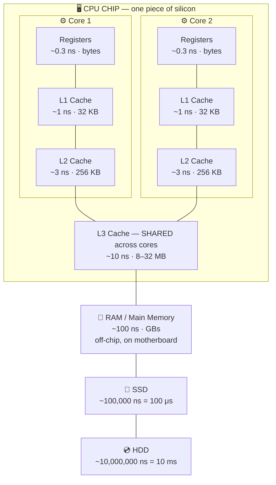
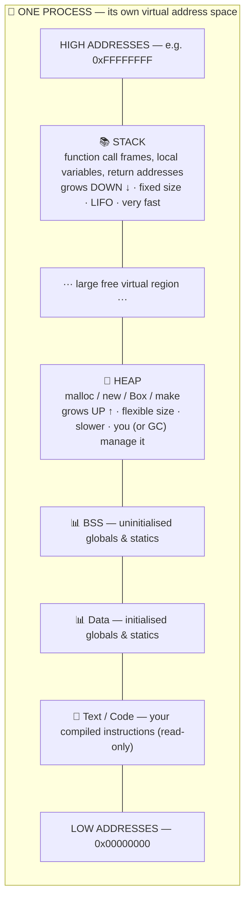
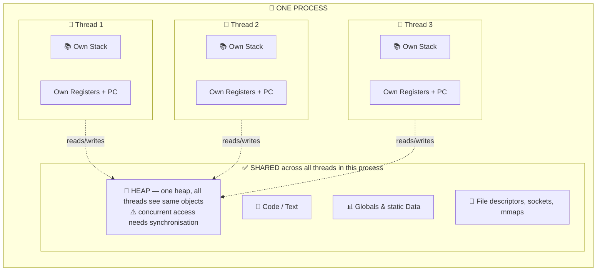
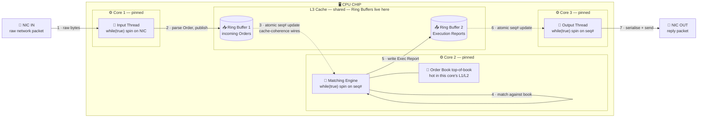

# CEX Matching Engine — Phase 1 Course (Go, Beginner Edition)

> Low Latency & Determinism.
> Three lessons. Teaching mode is gentle and explains every term. Drills are harsh.
> Assumes Go experience but **zero** low-level systems knowledge.

---

## Before You Start: What You're Building Toward

A centralized crypto exchange (CEX) like Binance or Coinbase has a component called a **matching engine**. Its job is simple to describe and very hard to build well:

1. Accept buy and sell orders from users.
2. Match them against each other (buyer at $100 meets seller at $100 → trade happens).
3. Keep the **order book** (the list of all unmatched orders) in perfect shape.
4. Do all this in **microseconds**, not milliseconds.

"Microseconds not milliseconds" is the hard part. A millisecond is 1/1000th of a second. A microsecond is 1/1,000,000th of a second. That's 1000x faster. An ordinary web server handling "fast" requests responds in 50-200 milliseconds. A matching engine must respond in 10-100 **micro**seconds. That's 5000x faster than a normal API.

To hit this target, you can't do ordinary things. You can't use ordinary queues, ordinary databases, or even ordinary memory access patterns. Everything in Phase 1 exists to teach you *why* the ordinary way is too slow, and *what* the fast way looks like.

Don't worry if this feels impossibly fast. By the end of Phase 1, you'll understand why it's achievable and you'll have built a toy engine that hits those numbers on your laptop.

---

## A Small Glossary You'll See A Lot

I'll explain these properly as they come up, but bookmark this for quick reference:

- **HFT** = High-Frequency Trading. Firms that make money by trading very fast.
- **Latency** = how long something takes. "Low latency" = fast. "Tail latency" = how slow your worst requests are.
- **Throughput** = how many things per second. "Throughput of 10M ops/sec" = 10 million operations per second.
- **p50, p99, p99.9** = percentile latency. p99 means "99% of requests are faster than this." p99 is 10ms means 1% of requests are slower than 10ms.
- **ns / μs / ms** = nanosecond (10⁻⁹ s), microsecond (10⁻⁶ s), millisecond (10⁻³ s). 1 ms = 1000 μs = 1,000,000 ns.
- **Thread** = a unit of execution managed by the operating system.
- **Goroutine** = Go's version of a thread. Lighter weight. Managed by Go's runtime, not the OS.
- **Lock / Mutex** = a mechanism to prevent two threads from touching the same data at the same time.
- **Atomic** = an operation that happens in one indivisible step. Cannot be interrupted halfway.
- **Allocation** = asking the runtime for a fresh chunk of memory. Usually slow, creates work for the garbage collector.
- **GC** = Garbage Collector. The part of Go's runtime that frees memory you're no longer using.
- **CPU cache** = a very fast, very small memory built into the CPU. Much faster than RAM.
- **Cache line** = the chunk of memory the CPU loads at once. Always 64 bytes on modern CPUs.

---

# Lesson 1: The LMAX Disruptor Pattern

## 1.1 Why This Lesson Exists

Here's a story. In 2010, a British financial exchange called **LMAX** (they trade currencies and commodities) was building a new trading system in Java. They used all the standard tools — Java's built-in queues, locks, thread pools. It worked. But they could only process about 60,000 orders per second. When the market got volatile and real trading firms sent a lot of orders, the system got slow and started to fall behind.

Their engineers realized the problem wasn't Java being slow. The problem was that the *standard tools* were fundamentally wrong for this kind of work. They threw them out and built something new, based on a deep understanding of how modern CPUs actually work. They called it the **Disruptor**.

After the rewrite, the same Java code on the same hardware did **6 million orders per second**. That's a 100x improvement. No magic, no extra hardware. Just a better understanding of the machine.

Every serious exchange today uses some version of the Disruptor pattern. If you want to build a matching engine, you have to understand it. This lesson teaches you the ideas behind it step by step, starting from "what is a CPU" and ending with "here is a lock-free ring buffer in Go."

## 1.2 What Is "Fast," Really?

When we say a matching engine is "fast," we mean specific numbers. Let me put them in context.

If you click a button on a website, the response comes back in roughly 100 milliseconds. That feels instant to you. A hummingbird's wing flaps every 16 milliseconds. You can't see a single flap because your eye doesn't react that fast.

A matching engine has to respond in **10 microseconds**. That's 10,000 times faster than a website response. It's 1600 times faster than a hummingbird wing flap. You cannot perceive that speed with any human sense.

Why do we need it that fast? Because professional traders' computers are also very fast, and if your engine takes 5 milliseconds when theirs takes 500 microseconds, they will see your price move and trade against you before you can react. Slow exchanges get picked off systematically. They also fall over during volatile moments — exactly when users need them to work.

### The latency numbers every engineer should know

Memorize this table. I'm serious — put it somewhere you can see. You'll refer to it constantly when reasoning about performance.

```
Operation                               Typical Latency
───────────────────────────────────────────────────────
1 CPU instruction                       ~0.3 ns
Reading from L1 cache                   ~1 ns
Reading from L2 cache                   ~4 ns
Reading from L3 cache                   ~12 ns
Reading from main memory (RAM)          ~100 ns
Acquiring an uncontested mutex          ~25 ns
Acquiring a contested mutex             1,000+ ns
Switching threads (context switch)      1,000 - 10,000 ns
Reading a small file from SSD           ~100,000 ns (100 μs)
Network round-trip in same data center  ~500,000 ns (500 μs)
Network round-trip across a country     ~40,000,000 ns (40 ms)
```

Look at that table carefully. Two things should jump out:

**Thing 1: RAM is slow.** Reading from main memory is 100 times slower than reading from the CPU's L1 cache. If your code makes the CPU go to RAM constantly, it will spend most of its time waiting, not computing.

**Thing 2: Locks under contention are catastrophic.** A mutex nobody else wants takes 25 nanoseconds. A mutex that two threads are fighting over takes 1000+ nanoseconds — 40 times slower. At 1 million operations per second, that extra 975 nanoseconds per operation costs you almost a full second every second. The system falls behind and never catches up.

The whole Disruptor pattern is about avoiding both of these disasters. It's about keeping data close to the CPU (in cache) and avoiding locks entirely.

## 1.3 How a CPU Actually Works (Just Enough)

You probably think of memory as one big pool — you write `x := 5` and the number 5 goes "into memory." That's a useful lie. The real picture has several layers.

### The memory hierarchy

Imagine a chef in a kitchen. She has:

- Her **hands** (can hold one ingredient at a time, instantly accessible).
- A **cutting board** right in front of her (holds a few ingredients, grab-and-go in under a second).
- A **counter** to her side (holds more ingredients, takes 2-3 seconds to reach for).
- A **refrigerator** across the kitchen (holds everything, takes 15 seconds to walk to).
- A **warehouse** down the street (nearly unlimited, takes 10 minutes to drive to).

The CPU works the same way. Instead of ingredients, it has data. The levels are:

- **CPU registers** = her hands. Tiny, a handful of 8-byte slots, instant access.
- **L1 cache** = cutting board. About 32 KB. ~1 nanosecond access.
- **L2 cache** = counter. About 256 KB. ~4 ns access.
- **L3 cache** = fridge. Shared by all CPU cores, a few MB. ~12 ns.
- **RAM** = warehouse. Gigabytes. ~100 ns.

When your Go program does `x := arr[i]`, the CPU first checks: is this data in L1? If yes, great — got it in 1 ns. If no, check L2 (4 ns). If not there, L3 (12 ns). If not there, we have to go to RAM (100 ns). That walk to the warehouse is called a **cache miss**, and it's the silent killer of performance.

### Cache lines

Here's a subtle point that changes everything. When the CPU goes to RAM to fetch your variable, it doesn't bring back just that variable. It brings back a **64-byte chunk** of memory — your variable and the 63 bytes next to it. This chunk is called a **cache line**.

Why 64 bytes? Because the CPU designers figured out that if you're reading one byte, you're probably going to read the next byte soon. So they grab a whole block while they're there. It's like going to the warehouse — you might as well grab a whole pallet, not one can.

This has huge consequences for how you structure data:

**Arrays are fast.** If you loop through an array of integers, each cache miss pulls 64 bytes = 8 integers at once. Next 7 iterations are basically free because they're already in cache.

**Linked lists are slow.** Each node is somewhere random in memory. Reading one node doesn't help you read the next one. You pay the cache miss penalty on every single access.

**Two variables next to each other in memory get loaded together.** This is usually good. But it can also cause problems, as you'll see.

### Multiple CPU cores

Your laptop has multiple CPU cores, maybe 4 or 8 or more. Each core has its own L1 and L2 cache. They share L3 cache and RAM.

If core 1 and core 2 are both working on the same piece of data, something has to keep their caches in sync. When core 1 writes to memory address X, the hardware has to make sure core 2 sees the new value — it does this by telling core 2 "throw away your cached copy, you have to reload it." This is called **cache coherence**, and the invalidation message costs about 40 nanoseconds per round trip between cores.

If two cores keep writing to the same memory constantly, they spend all their time invalidating each other's caches. The data bounces back and forth between them like a ping-pong ball, never settling anywhere. Throughput collapses. We'll see this problem (called **false sharing**) in detail soon.

## 1.4 Threads, Goroutines, and Why Coordination Is Hard

### What is a thread?

A thread is a sequence of instructions the CPU executes. When you start a program, it runs on one thread by default. Modern programs often have many threads running at once.

In Go, you don't usually create threads directly. You create **goroutines**, which are Go's lightweight version. Go's runtime maps thousands of goroutines onto a small number of actual OS threads (usually equal to your CPU core count). When you write `go doSomething()`, you're creating a goroutine, and Go's scheduler decides when to run it on an OS thread.

The key property: **multiple goroutines run simultaneously**. If two goroutines both try to modify the same variable at the same time, the result depends on the exact timing of their instructions. This is called a **race condition**, and it's the root cause of most hard concurrency bugs.

### The race condition problem

Look at this simple code:

```go
var counter int
counter = counter + 1  // Looks like one operation, but it isn't
```

What the CPU actually does:

1. Load `counter` from memory into a register (a temporary CPU storage slot).
2. Add 1 to the register.
3. Store the register back to memory.

If two goroutines run this code simultaneously, something like this can happen:

```
Goroutine A: reads counter (value: 5)
Goroutine B: reads counter (value: 5)
Goroutine A: adds 1 (register now has 6)
Goroutine B: adds 1 (register now has 6)
Goroutine A: writes 6 to memory
Goroutine B: writes 6 to memory

Final value: 6. Should have been 7.
```

You lost an increment. Now imagine this happening a million times per second in a matching engine. Orders would disappear. Balances would be wrong. The exchange would be bankrupt by Tuesday.

So we need **coordination**: a way to ensure two goroutines don't step on each other. The standard tool is a **lock**, also called a **mutex**.

### What is a mutex, mechanically?

Mutex stands for "mutual exclusion." Think of it as a bathroom key at a gas station. Only one person can have it at a time. If someone else wants to use the bathroom, they have to wait until you put the key back.

In code:

```go
var mu sync.Mutex
var counter int

mu.Lock()           // Grab the key (if nobody has it)
counter = counter + 1
mu.Unlock()         // Put the key back
```

With the mutex, only one goroutine can be between `Lock()` and `Unlock()` at any moment. No race conditions. Correct code.

So what's the problem?

### Why locks are slow

When nobody else is holding the mutex, `Lock()` is very fast — about 25 nanoseconds. It does one tiny CPU operation (a **compare-and-swap**, which we'll explain later) and proceeds.

But when another goroutine already holds the mutex, things get expensive:

1. Your goroutine tries to grab the lock. Fails.
2. Go's runtime spins for a brief moment, hoping the other goroutine is about to release.
3. If still locked, the runtime **parks** your goroutine — takes it off the CPU scheduler entirely. At the OS level on Linux, this becomes a `futex` system call (a "fast userspace mutex" call to the kernel).
4. The OS kernel marks the thread as sleeping.
5. When the lock finally releases, the kernel wakes your thread up.
6. Go's runtime puts your goroutine back on a CPU.
7. Your goroutine finally acquires the lock and proceeds.

All of that takes 1,000-10,000 nanoseconds. At 10 million operations per second, if half of them are contested, you're paying 5 billion nanoseconds of overhead per second. Since there are only 1 billion nanoseconds in a second, you've lost before you started.

### Cache line bouncing on locks

There's an even subtler problem. The mutex itself is a variable sitting in memory. Let's say it lives at address 0x1000. Core 1 holds it. When core 2 tries to acquire, core 2's CPU reads address 0x1000 — but the "owned" flag was just updated by core 1. So core 2's cache has a stale copy. Cache coherence kicks in: core 2 has to re-fetch the memory, which takes 40+ nanoseconds.

Now core 2 acquires the lock, writes to 0x1000. Core 3 was also trying — cache coherence fires again. Core 1 was about to check the lock — fires again. The mutex's memory location becomes a ping-pong ball. Every acquisition pays a cache-coherence cost on top of everything else.

This is why the Disruptor's whole philosophy is "locks are the enemy." Not because they're wrong, but because they're 1000x too slow for a matching engine's hot path.

## 1.5 Atomics: Coordination Without Locks

So we need to coordinate between goroutines, but we can't use mutexes. What's the alternative?

**Atomic operations.** An atomic operation is a single CPU instruction that does something useful (like "add 1 to this counter") in one indivisible step. The CPU guarantees that no other core can see the operation half-complete. No other core can interleave a read between your load and store.

Go's `sync/atomic` package exposes these:

```go
import "sync/atomic"

var counter int64

atomic.AddInt64(&counter, 1)
// ^ Compiles to a single CPU instruction called "LOCK XADD"
// Cost: ~5-20 nanoseconds. No goroutine parking. No kernel call.

atomic.LoadInt64(&counter)
// ^ Reads the value with a memory barrier (see next section). Single instruction.

atomic.StoreInt64(&counter, 42)
// ^ Writes the value with a memory barrier. Single instruction.

atomic.CompareAndSwapInt64(&counter, oldVal, newVal)
// ^ Reads counter. If it's oldVal, writes newVal. Otherwise does nothing.
//   Returns true if the swap happened. This is the magic primitive.
//   Cost: single instruction, ~10-20 ns.
```

Atomics are 50x to 1000x faster than contested mutexes, depending on the situation. They're the foundation of lock-free programming.

But they come with a trap. Atomics only guarantee that one specific variable changes atomically. If you need to coordinate multiple variables, or make one change depend on another variable's state, atomics alone aren't enough. That's why we need memory barriers.

## 1.6 Memory Barriers: The Reordering Problem

Here's something that will shake your understanding of computers. Modern CPUs and compilers **reorder your instructions** behind your back.

You write:

```go
data = 42
ready = 1
```

But the compiler might output:

```go
ready = 1
data = 42
```

Why? Because it thinks these two writes are independent, and maybe it can schedule them more efficiently. The compiler proves to itself that within *this single goroutine*, it doesn't matter — the goroutine still sees the same end result. But if another goroutine is watching, it might see `ready = 1` before `data = 42`. This breaks your program.

The CPU does the same thing. It has a component called a **store buffer** that holds pending writes. When you do `data = 42; ready = 1`, both writes go into the buffer. The buffer flushes to memory whenever it feels like it, and not necessarily in program order.

Here's the classic bug this causes:

```go
// Shared state
var data int
var ready int32

// Goroutine A
data = 42
atomic.StoreInt32(&ready, 1)    // <-- barrier here

// Goroutine B
if atomic.LoadInt32(&ready) == 1 {  // <-- barrier here
    fmt.Println(data)  // Prints 42, guaranteed.
}
```

If we hadn't used atomic operations, goroutine B might see `ready == 1` but read stale `data` (say, 0). The atomic operations include **memory barriers** — special instructions that tell both the compiler and CPU "don't reorder across this line, and flush all pending writes before moving on."

In English: `atomic.StoreInt32(&ready, 1)` doesn't just write 1. It also guarantees that all previous writes (including `data = 42`) are visible to any goroutine that sees the new value of `ready`. This is called the **happens-before** relationship.

This is how the Disruptor coordinates without locks. The producer writes event data to the ring buffer, then uses an atomic store to publish a sequence number. The consumer loads the sequence number atomically; if it sees the new value, it's guaranteed to also see the event data. No lock needed.

## 1.7 False Sharing: The Silent Killer

Remember that cache lines are 64 bytes? And remember that writes on one core invalidate the cache on other cores? Here's how those two facts combine to destroy performance.

Consider this struct:

```go
type Counters struct {
    producerSeq int64   // 8 bytes
    consumerSeq int64   // 8 bytes
}
```

These two fields live right next to each other in memory. Total: 16 bytes. Both fit within a single 64-byte cache line.

Now imagine:

- Goroutine P is running on core 1, constantly writing to `producerSeq`.
- Goroutine C is running on core 2, constantly reading from `consumerSeq`.

They don't share any actual data. `producerSeq` and `consumerSeq` are logically independent. But physically, they're on the same cache line.

What happens:

1. Core 1 writes to `producerSeq`. This invalidates the cache line on core 2.
2. Core 2 wants to read `consumerSeq`. Its cache copy is invalid. It has to re-fetch the whole line from L3 or RAM. Cost: 40+ ns.
3. Core 2 is now about to... well, it's just reading, so it doesn't invalidate core 1.
4. But core 1 writes again. Invalidates core 2's line.
5. Core 2 reads again. Cache miss. Re-fetch. 40+ ns.

Every single operation costs 40+ nanoseconds that shouldn't be there. The cores are fighting over memory they don't actually share, but the hardware can't tell the difference at finer than cache-line granularity.

This is called **false sharing**, and in a hot inner loop it can cause a 10x slowdown for no apparent reason.

### The fix: padding

Force the two variables onto different cache lines by putting dead space between them:

```go
type Counters struct {
    _           [8]int64   // 64 bytes of padding before
    producerSeq int64      // 8 bytes (sits on its own cache line)
    _           [7]int64   // 56 bytes of padding after (rest of line)
    consumerSeq int64      // 8 bytes (own cache line)
    _           [7]int64   // 56 bytes of padding after
}
```

Now `producerSeq` and `consumerSeq` are 64+ bytes apart, guaranteed on different cache lines. No more false sharing.

This looks ugly. It wastes memory (~100 bytes per counter). It's absolutely essential in high-performance code. Every real Disruptor implementation does this.

Java has an annotation `@Contended` that does this automatically. Go has no such thing — you write the padding by hand.

## 1.8 The Ring Buffer

Now we're ready for the main event.

A **queue** is a data structure where you add items to the back and remove them from the front. First-in, first-out (FIFO). Go's channels are basically queues.

A **ring buffer** (also called a **circular buffer**) is a queue with two tricks:

**Trick 1: Fixed size, pre-allocated.** You decide at startup how many slots it has. Say, 1024. That memory is allocated once, at the start of the program, and never grows or shrinks.

**Trick 2: Indices wrap around.** The producer writes to slot 0, then slot 1, then 2... when it hits slot 1023, it wraps back to slot 0. The consumer follows behind, reading the slots the producer has published.

### A picture

```
Size = 8 slots for illustration. Indices 0 through 7.

Iteration 1: Producer writes slot 0, 1, 2, 3.
   Index: 0    1    2    3    4    5    6    7
        [E0] [E1] [E2] [E3] [  ] [  ] [  ] [  ]
                                 ^
                            producer is here

Iteration 2: Consumer reads E0, E1.
   Index: 0    1    2    3    4    5    6    7
        [E0] [E1] [E2] [E3] [  ] [  ] [  ] [  ]
                   ^             ^
              consumer      producer
              (has read E0, E1)

Iteration 3: Producer fills rest and wraps around.
   Index: 0    1    2    3    4    5    6    7
        [E8] [E1] [E2] [E3] [E4] [E5] [E6] [E7]
         ^         ^
   producer   consumer
   (wrapped)  (still reading E2)
```

The producer keeps writing. When it reaches slot 7 and needs to write slot 8, it uses slot `8 % 8 = 0`. It **overwrites** the old value at slot 0 — but only if the consumer has already read it. If the consumer is behind, the producer waits.

### Why power-of-2 sizes matter

Computing `8 % 8 = 0` involves an integer division operation. Division is slow — about 20-40 CPU cycles. In a hot loop running 10 million times per second, that's a lot.

But! There's a trick: if the buffer size is a power of 2 (like 1024 = 2¹⁰), you can replace `index % size` with `index & (size - 1)`. This is a **bitwise AND** operation, which takes exactly 1 CPU cycle.

How does it work? Let's see. `size = 8`, `size - 1 = 7`, which in binary is `0111`.

```
index = 11 (binary: 1011)
size - 1 = 7 (binary: 0111)
11 & 7 = ? Let's compute bit-by-bit:

1011
0111
----
0011  = 3

11 % 8 = 3.  Same answer.
```

The bitmask keeps the lowest 3 bits (since 0111 has its lowest 3 bits set) and clears the rest. Because the buffer has 8 slots and 8 = 2³, the lowest 3 bits ARE the index within the buffer.

**Rule:** Ring buffer sizes must be powers of 2. No exceptions. "I want exactly 1000 slots" is wrong. Pick 1024.

### Why slots are never allocated

In normal Go code, if you want to add an event to a queue, you probably do `events = append(events, event)`. If `events` is full, Go allocates a new, bigger underlying array, copies the data over, and returns the new slice. This allocation creates garbage that the GC has to clean up later — which will pause your hot loop.

In a ring buffer, no allocation happens. The slots are **overwritten in place**. The memory was allocated once at startup, and it's used forever. Zero garbage. Zero GC pressure. This is critical and we'll explore it much more in Lesson 3.

## 1.9 Coordination in the Disruptor

Alright, let's tie it all together. We have:

- A ring buffer of fixed size.
- A single goroutine called the **producer** that writes to the ring.
- A single goroutine called the **consumer** that reads from the ring.
- Two atomic counters: `producerSeq` (where the producer has published up to) and `consumerSeq` (where the consumer has read up to).

The counters are padded to separate cache lines (no false sharing). The counters start at -1 (so the first thing written is at index 0).

### Producer logic

```
To publish event E:

1. next = producerSeq + 1
   (The next sequence number we want to write.)

2. Is slot (next & mask) free? It is free if the consumer has already read it.
   In other words: next - consumerSeq <= bufferSize.

3. If the slot isn't free yet, wait. (Consumer hasn't caught up; we'd overwrite
   unread data.)

4. Once free, write E to ring[next & mask].

5. atomic.Store(&producerSeq, next).
   This publishes the event. The memory barrier ensures the consumer sees
   the event data after seeing the new producerSeq.
```

### Consumer logic

```
To consume the next event:

1. next = consumerSeq + 1
   (The next sequence number we want to read.)

2. published = atomic.Load(&producerSeq).
   What has the producer made available?

3. If next > published, nothing new yet. Wait.

4. Once available, read ring[next & mask] into E.

5. Process E.

6. atomic.Store(&consumerSeq, next).
   This tells the producer "I'm done with this slot, you can overwrite it."
```

That's the entire protocol. No mutex. Just two atomic counters, coordinated through memory barriers.

The key property: **only one goroutine writes to each variable**. The producer writes `producerSeq` and `ring[i]`. The consumer writes `consumerSeq`. This is called the **single-writer principle**, and it eliminates the need for compare-and-swap loops or any other complex coordination. Each counter has exactly one writer and any number of readers.

## 1.10 Wait Strategies

What does "wait" mean in step 3 of the producer, or step 3 of the consumer? You have three choices, with very different tradeoffs.

**Busy spin:**

```go
for atomic.LoadInt64(&producerSeq) < next {
    // Do nothing. Just loop.
}
```

The CPU core is 100% busy, constantly checking the variable. Latency to detect a new event is under 100 nanoseconds. But you burn an entire CPU core doing nothing. In HFT, this is totally normal — you have a dedicated core for the engine and you don't care about wasting cycles. It's the price of minimum latency.

**Yielding spin:**

```go
for i := 0; atomic.LoadInt64(&producerSeq) < next; i++ {
    if i > 100 {
        runtime.Gosched()   // "Yield my timeslice to other goroutines."
        i = 0
    }
}
```

Spin for 100 iterations, then let the Go scheduler run something else briefly, then come back. Latency is microseconds instead of nanoseconds, but CPU use is moderate. Reasonable default for most applications.

**Blocking:**

Use a Go channel or a condition variable. The goroutine sleeps until woken up. Latency can be 1-10 milliseconds (terrible for HFT). CPU use is near zero when idle. If you're going to block, just use a Go channel and skip the Disruptor entirely.

**For a matching engine: busy spin on a dedicated core.** You commit one or two CPU cores to the engine and they run hot all the time. That's the tradeoff.

## 1.11 A Complete Disruptor in Go

Here's the full code with heavy comments. Read every comment.

```go
package ringbuf

import (
    "runtime"
    "sync/atomic"
)

// Event is what we pass through the ring buffer. It's a fixed size so
// it fits in predictable memory. In a real matching engine, this would
// hold order data: ID, price, quantity, side, etc.
//
// Note: we use an array of bytes rather than a pointer to some struct,
// so the event data lives inside the ring itself. No pointer-chasing.
type Event struct {
    Payload [56]byte  // 56 bytes of payload
    // (We might add 8 more bytes of metadata to make this 64 bytes total,
    //  one cache line. But 56 is fine for demonstration.)
}

const (
    bufferSize = 1024          // Must be a power of 2.
    mask       = bufferSize - 1 // Used for index math: i & mask == i % bufferSize.
)

// Disruptor is the ring buffer + coordination logic.
//
// Why the strange layout with [7]int64 padding? Because producerSeq and
// consumerSeq must NOT share a cache line. Without padding, writes to
// one would invalidate the other on different CPU cores, causing massive
// slowdown (false sharing, see Section 1.7).
//
// The [7]int64 = 56 bytes + the int64 field = 64 bytes = exactly one cache line.
// So each field gets its own cache line, no sharing.
type Disruptor struct {
    _           [7]int64           // Padding before producerSeq.
    producerSeq int64              // Written only by producer. Read by consumer.
    _           [7]int64           // Padding after producerSeq.
    consumerSeq int64              // Written only by consumer. Read by producer.
    _           [7]int64           // Padding after consumerSeq.
    ring        [bufferSize]Event  // The ring buffer itself.
}

// New creates a fresh Disruptor.
func New() *Disruptor {
    return &Disruptor{
        producerSeq: -1,  // Nothing published yet.
        consumerSeq: -1,  // Nothing consumed yet.
    }
}

// Publish is called by the ONE producer goroutine. It places the event
// into the ring and updates the producer sequence.
//
// If the ring is full (consumer hasn't caught up), it yields to the scheduler
// and retries. In a real engine you might busy-spin instead for lower latency.
func (d *Disruptor) Publish(e Event) {
    next := d.producerSeq + 1

    // Wait until the consumer has read enough to free the slot.
    // The slot we want to write is (next & mask). That slot currently
    // holds the event with sequence (next - bufferSize), which the
    // consumer must have already consumed.
    //
    // In other words: next - consumerSeq must be <= bufferSize.
    for next-atomic.LoadInt64(&d.consumerSeq) > bufferSize {
        runtime.Gosched()
    }

    // Write the event to its slot. No other goroutine writes here.
    d.ring[next&mask] = e

    // Publish. The atomic store has a memory barrier, so the consumer
    // is guaranteed to see the event data once it sees the new producerSeq.
    atomic.StoreInt64(&d.producerSeq, next)
}

// Consume is called by the ONE consumer goroutine. It reads the next
// event from the ring, or waits if nothing is available yet.
func (d *Disruptor) Consume() Event {
    next := d.consumerSeq + 1

    // Wait for the producer to publish up to our next sequence.
    for atomic.LoadInt64(&d.producerSeq) < next {
        runtime.Gosched()
    }

    // Read the event. Thanks to the memory barrier in Publish, we see the
    // full event data, not a partial write.
    e := d.ring[next&mask]

    // Advance our consumer sequence. The producer reads this to know the
    // slot is free for reuse.
    atomic.StoreInt64(&d.consumerSeq, next)

    return e
}
```

That's 60 lines of code. It's a real production-pattern ring buffer, minus some refinements (multi-consumer support, batch consumption, busy-spin wait strategy). You could build a matching engine on top of this today.

## 1.12 Important Gotchas When Writing This in Go

**1. Go channels aren't as fast as you might think.**

Go's `chan Event` is a beautifully designed queue, but under the hood it uses a mutex. The mutex isn't contested for most operations, so it's fast (~50 ns per send/receive), but it caps your throughput at around 5-20 million messages per second. A custom SPSC ring buffer can hit 100+ million. For most applications, channels are fine. For a matching engine's hot path, they're not.

**2. The Go garbage collector can pause your hot loop.**

Even if your Disruptor code is perfect, if the overall program is allocating memory, the GC will periodically pause all goroutines to clean up. These pauses are usually under 1ms in modern Go, but that's still 100x slower than your target latency. Lesson 3 is entirely about eliminating allocations.

**3. Be careful with `interface{}` / `any`.**

If you make your ring buffer hold `any` instead of a concrete type like `Event`, every event you publish will be "boxed" onto the heap. That's one allocation per event. That's terrible. Always use a concrete type.

**4. Escape analysis can surprise you.**

Go tries to put variables on the stack (fast, free) rather than the heap (slow, GC-managed). Sometimes it decides a variable has to go on the heap even when you expect the stack. You can check with `go build -gcflags="-m"`. If you see "moved to heap: x" for something in your hot path, that's an allocation per operation, which is bad.

**5. Pinning goroutines to CPU cores is hard in Go.**

For the absolute lowest latency, you want to pin your producer and consumer goroutines to specific CPU cores so the OS doesn't move them around (each move is a 3000 ns hit for context switching and cache misses). Go has `runtime.LockOSThread()` which pins a goroutine to an OS thread, but pinning that thread to a specific CPU core requires low-level syscalls. It's possible but clunky. This is one major reason HFT firms often prefer C++ or Rust over Go for the matching core.

## 1.13 Summary: The Rules

1. **Understand the memory hierarchy.** RAM is 100x slower than L1 cache. Data locality dominates performance.
2. **Cache lines are 64 bytes.** Accessing one byte pulls in 63 neighbors. Design data layout with this in mind.
3. **Locks are catastrophic under contention.** 1000+ nanoseconds is the price. Use atomics when you can.
4. **Memory barriers synchronize multiple variables.** Atomic operations include barriers; plain reads/writes don't.
5. **False sharing is invisible and expensive.** Pad hot variables to separate cache lines (64 bytes apart).
6. **Ring buffer sizes must be powers of 2.** Use bitmask for indexing (`i & mask`), not modulo (`i % size`).
7. **Single-writer principle.** One goroutine owns writes to each variable. Others read only.
8. **Pre-allocate everything.** No `make`, no `new` in the hot path. No GC pressure.
9. **Go channels aren't fast enough for the matching engine hot path.** They're fine for everything else.

## 1.14 Drill 1

Rules: Show mechanism and measurements, not vibes. "I think X" without hardware reasoning gets zero credit. Reply with your answers and I'll tear them apart.

**Q1. Explain the mechanism.**

In your own words, explain at the hardware level why a mutex-based queue is roughly 10x slower than a lock-free ring buffer when operating at 10 million operations per second. Name at least three distinct physical costs that the mutex pays and the ring buffer doesn't. Don't say "locks are slow" — explain what "slow" means in terms of:
- CPU cycles spent
- Kernel interactions (context switches, futex calls)
- Cache coherence traffic between cores

You should be able to write at least 200 words explaining this.

**Q2. Implement an SPSC ring buffer in Go.**

Requirements:
- Size: 1024 slots. Use a bitmask for indexing.
- One atomic `int64` for the producer sequence, one for the consumer sequence.
- Padding between the two sequences to prevent false sharing. Justify your padding size.
- `Publish(e Event)` blocks with `runtime.Gosched()` when the buffer is full.
- `Consume() Event` blocks with `runtime.Gosched()` when empty.
- NO `sync.Mutex`, NO channels.
- Event type: a struct with `OrderID int64`, `Price int64`, `Quantity int64`, `Side byte`.

Then: compute your `Event` struct's size using `unsafe.Sizeof`. Report it. Is it cache-line friendly? If not, pad it and explain your padding.

**Q3. The power-of-2 question.**

Explain in your own words why ring buffer sizes must be powers of 2. Show the bit pattern for `size = 8` and `size - 1 = 7`, and walk through `index & (size-1)` for `index = 17`. Prove it equals `17 % 8`.

If I say "I want the ring to hold exactly 1000 events," what do you tell me, and why?

**Q4. Benchmark three implementations.**

Write a Go benchmark (using `testing.B`) that passes 10 million `Event`s from one producer goroutine to one consumer goroutine using:
- (a) `chan Event` with buffer size 1024.
- (b) A slice-based queue of capacity 1024 protected by `sync.Mutex`.
- (c) Your ring buffer from Q2.

Report ns/op for each. Determine:
- Which is fastest? Slowest? By what factor?
- If (c) isn't at least 3x faster than (a), find the bug. Common causes: accidentally allocating in the hot path, false sharing you didn't pad out, a logic error causing spinning.

**Q5. The false sharing experiment.**

In your Q2 implementation, point to the exact lines where false sharing would occur if you removed the padding. Then actually remove the padding and re-run the benchmark. Report the new ns/op. Explain the delta in terms of cache coherence traffic between the producer's CPU core and the consumer's.

If you see no delta (unlikely but possible): your test probably isn't running the two goroutines on different physical cores, or your struct layout is accidentally isolating the fields. Investigate which.

**Q6. Reading.**

Read the original LMAX Disruptor technical paper (Martin Thompson, Dave Farley, et al., 2011). It's about 11 pages. Search for "LMAX Disruptor: High Performance Alternative to Bounded Queues for Exchanging Data Between Concurrent Threads."

After reading, answer:
- What throughput did LMAX achieve, on what hardware?
- What does the term "mechanical sympathy" mean in the paper? Give one concrete example from their text.
- Why does the paper argue that queues — even lock-free queues — are architecturally wrong for this problem?

---

# Lesson 2: Determinism

## 2.1 Why This Lesson Exists

Imagine you run an exchange. At 3:47 PM Tuesday, something goes wrong — your matching engine produces a trade that shouldn't have happened, and a user loses $50,000. A regulator shows up wanting to know what happened.

You go to your logs. You see the orders that came in. You try to figure out why the engine matched them the way it did. But when you try to reproduce the bug by replaying the events, **the engine produces a different answer this time**. It doesn't repeat the bad trade. You can't explain what happened.

This is a nightmare. It's also the default behavior of most software. Without careful design, running the same program twice on the same input gives slightly different answers, because of:

- Wall-clock time differences.
- Random iteration orders.
- Concurrent goroutine interleavings.
- Floating-point math rounding.

A matching engine must be **deterministic**: given the same inputs in the same order, it must produce the exact same outputs. Every time. Byte-for-byte identical. If you have this property, you can:

- **Replay events** to reproduce bugs.
- **Run two replicas** simultaneously (primary and standby) and know they're in identical state.
- **Fail over instantly** without any state transfer — the standby has been mirroring the primary all along.
- **Audit decisions** — if someone questions a trade, you can prove exactly why it happened.

This lesson teaches you how to build a matching engine as a **pure function**, and the dozen specific things in Go that will ruin determinism if you're not careful.

## 2.2 What Does "Deterministic" Actually Mean?

A function is **deterministic** if calling it with the same input always produces the same output. A function is **non-deterministic** if it can return different outputs for the same input.

Examples:

```go
// Deterministic.
func add(a, b int) int {
    return a + b
}
// add(2, 3) always returns 5. Forever. Guaranteed.

// Non-deterministic.
func timestamp() int64 {
    return time.Now().UnixNano()
}
// Different value every time you call it.

// Non-deterministic.
func randomPrice() float64 {
    return rand.Float64() * 100
}
// Random, different value every time.

// Non-deterministic (this might surprise you).
func countByKey(m map[string]int) []string {
    result := []string{}
    for k := range m {
        result = append(result, k)
    }
    return result
}
// Go randomizes map iteration order. This can return keys
// in different orders on different runs.
```

The matching engine must be like `add`, not like `timestamp`. Given the same input orders, it must produce the same output trades, in the same order, with the same timestamps, every time.

## 2.3 What Is a "Pure Function"?

This is a term from functional programming. A pure function has two properties:

1. **Given the same inputs, it returns the same outputs.** (Deterministic.)
2. **It has no side effects.** It doesn't modify anything outside itself. It doesn't write files, log to stdout, touch global variables, or call external services.

The matching engine is almost a pure function. We relax rule #2 a little — the engine does update its internal state (the order book) and emit outputs (trades). But we structure it as:

```
match(oldState, event) -> (newState, outputs)
```

Same old state + same event = same new state + same outputs. Always. This is the critical property.

What does this look like in practice?

```go
type EngineState struct {
    Book OrderBook
    // ... other state
}

// Pure function form.
func Match(state EngineState, event Event) (EngineState, []Trade) {
    // Process the event. Return the new state and any generated trades.
    // No side effects. No time.Now(), no logging, no network calls.
}
```

In real code, for performance reasons, we mutate state in place rather than returning a new one. That's fine as long as conceptually the function is pure:

```go
func (e *Engine) Step(event Event) []Trade {
    // Update e's internal state based on the event.
    // Return any trades generated.
    // No external side effects.
}
```

Same engine state + same event = same internal state changes + same trades returned. That's the contract.

## 2.4 What Is "Event Sourcing"?

This is a concept that sounds fancy but is actually simple. Consider your bank account. At any moment, you have a balance — say, $1,523.47.

There are two ways the bank could store this:

**Way 1: Store the current balance.** Keep a single number, $1,523.47. Update it every time you deposit or withdraw.

**Way 2: Store the history of transactions.** Keep a list: +$1,000 (deposit), -$50 (coffee), +$2,000 (paycheck), -$1,426.53 (rent). Compute the balance by adding them all up.

Way 2 is **event sourcing**: the authoritative state is the log of events, not the current snapshot. The snapshot is derived; you could throw it away and rebuild it from the log.

Why does event sourcing matter for a matching engine? Because:

- **The log is the source of truth.** If the in-memory order book disappears (crash, power loss), you rebuild it from the log.
- **You can replay to debug.** Feed the log into a fresh engine, reproduce any situation.
- **You can run parallel replicas.** Both replicas consume the same log, both end up in the same state.
- **You can audit.** Every trade traces back to the exact sequence of events that caused it.

In practice, the log is usually a Kafka topic. Producers (API gateways) write events to Kafka. The matching engine consumes events in order. Events are immutable — once written, never changed.

## 2.5 State Machine Replication

Here's the payoff of determinism + event sourcing. Suppose:

- You have a **primary** matching engine running in data center 1.
- You have a **standby** matching engine running in data center 2.
- Both consume the same Kafka topic of order events.
- Both run the same pure-function engine code.

**Claim:** at any moment, both engines' internal states are bit-for-bit identical. They contain the same orders in the same positions in the order book. They've produced the same trades.

Why? Because they're consuming the same inputs through the same deterministic function. No matter how much we scramble the order of events from the outside world, once those events are in the log in a fixed order, both engines see them in that order and produce identical state.

If the primary dies, the standby is already "ahead" (or the same, or very close). You just point users at the standby and keep going. Zero data loss, zero state transfer, sub-second failover.

This is called **state machine replication**. It's one of the most elegant ideas in distributed systems. Your only job, as the engine author, is to be deterministic. Everything else (making sure the event log is consistent across replicas) is handled by upstream infrastructure (consensus protocols like Raft, or Kafka's partition log guarantees).

## 2.6 Where Determinism Goes Wrong in Go

Now the practical part. Go has specific features that will break your determinism. You must know every one of them.

### Non-determinism source #1: `time.Now()`

The wall clock is the most obvious problem. Two machines have slightly different clocks. A single machine's clock drifts. Daylight saving time happens. Leap seconds happen. NTP resyncs change the time.

If your engine does:

```go
func (e *Engine) handleOrder(o Order) {
    o.ReceivedAt = time.Now()  // <-- DISASTER
    // ... process ...
}
```

Replica A at 14:23:01.123456 sees `time.Now()` return one value. Replica B processing the same event a microsecond later sees a slightly different value. Now their order books differ in the timestamps on every order. Even if the matching logic is identical, the output events contain different timestamps. They're no longer bit-identical.

**The fix:** time comes from the event, not the engine.

```go
type Event struct {
    // ... other fields
    Timestamp int64  // Nanoseconds since Unix epoch. Set by the upstream
                      // sequencer, before the event enters the engine.
}

func (e *Engine) handleOrder(evt Event) {
    // Use evt.Timestamp for anything that needs time.
    // NEVER call time.Now() here.
}
```

The sequencer (an upstream service) stamps each event with a timestamp when it arrives. That timestamp is now part of the event itself. Both replicas see the same stamped timestamp and produce identical output. The engine never calls `time.Now()`.

### Non-determinism source #2: Map iteration order

Go's designers made a deliberate decision: iterating a map returns keys in a **random** order, different on every execution. They did this so that programmers wouldn't accidentally depend on iteration order (which would break if the map implementation ever changed).

In most applications, this is fine and actually helpful. In a deterministic system, it's a catastrophe.

```go
// If e.bids is map[int64]*PriceLevel, this loop iterates in random order.
for price, level := range e.bids {
    // This does different things on different runs.
}
```

Replica A iterates prices in order 100, 105, 103, 108. Replica B iterates 105, 103, 100, 108. If the logic inside the loop depends on ordering, the engines diverge.

**The fix:** never iterate a map in logic that produces output or changes state. Use **sorted slices** or a **tree** (like a B-tree keyed by price).

```go
// Bids are stored as a sorted slice, descending by price.
type OrderBook struct {
    Bids []*PriceLevel  // Bids[0] is the highest bid.
    Asks []*PriceLevel  // Asks[0] is the lowest ask.
}

// Iteration is deterministic.
for _, level := range book.Bids {
    // Always in the same order.
}
```

You might use a map for *lookups* (e.g., find a price level by price) but never for *iteration* in the matching logic. Or better, use a tree structure that gives you both fast lookup and sorted iteration.

### Non-determinism source #3: Goroutine scheduling

If two goroutines both modify the order book, the order of their modifications is unpredictable. Go's scheduler doesn't promise any particular interleaving. Replica A might process event 1 then 2; replica B might process 2 then 1.

**The fix:** the matching engine runs on a single goroutine. One at a time, in order, forever. No concurrency inside the engine.

```go
// Single-goroutine event loop.
func (e *Engine) Run(in <-chan Event) {
    for evt := range in {
        e.Step(evt)  // Sequential. No goroutines inside.
    }
}
```

If you want parallelism, you get it by running multiple engines for different trading pairs (BTC-USDT on one engine, ETH-USDT on another). Each engine is single-threaded. Each pair's order book is modified by exactly one goroutine.

### Non-determinism source #4: Floating-point math

This one shocks most programmers. You would think `0.1 + 0.2` equals `0.3`. In IEEE 754 floating point (which is what Go uses for `float64`), it actually equals `0.30000000000000004`. There's a tiny rounding error because most decimal fractions can't be exactly represented in binary.

It gets worse. Some CPU operations use 80-bit intermediate precision internally, then round to 64 bits. Different CPUs, different compilers, and even different optimization levels can produce slightly different results for the same calculation.

`(a + b) + c` and `a + (b + c)` can produce different `float64` values. Yes, seriously.

For a matching engine that tracks money, this is unacceptable. One user's balance would be `$100.0000000001` on replica A and `$100.0` on replica B. Transfer errors. Over time, the books don't balance. Your exchange is broken.

**The fix:** never use `float64` for money. Use **fixed-point integer arithmetic**.

Here's what that means. Instead of storing `50000.12345678` as a float, you pick a scale (say, 10⁸) and store `5000012345678` as an `int64`. All math becomes integer math, which is 100% deterministic on every platform.

```go
const priceScale = 100_000_000  // 10^8, so 1 tick = 0.00000001 of the unit.

// $50000.12345678 as a price in ticks:
priceTicks := int64(5000012345678)

// Addition is trivial.
newPriceTicks := priceTicks + otherTicks  // Integer math. Always the same answer.

// Multiplication of two priced quantities: tricky, but doable.
// (priceTicks * qtyTicks) / priceScale to keep the scale consistent.
```

Exchanges call these "ticks" or "pips" or "satoshis" (for Bitcoin). The smallest representable unit. All internal math uses these integers. Conversion to human-readable decimal numbers happens only at the edge, when displaying to users.

### Non-determinism source #5: `math/rand` without a fixed seed

Go's `math/rand` package, if you call `rand.Int()` without seeding, uses a fixed seed (1) starting in Go 1.20, so it's actually deterministic by default. But before 1.20 it was seeded from... well, it didn't automatically seed at all.

Either way: if you're using randomness in the engine, make sure the seed is derived from the event or event ID. Better, don't use randomness in the engine at all. Whatever needed a random choice should have been decided upstream and included in the event.

### Non-determinism source #6: Memory addresses

Every time your program runs, variables live at different memory addresses (this is called **ASLR**, address space layout randomization, a security feature). If you ever use a memory address in your logic — say, `fmt.Sprintf("%p", &order)` or sorting by pointer value — your output changes between runs.

Less obviously: Go's built-in map hashes pointer keys by their address. This is one of the reasons map iteration order differs.

**The fix:** never use memory addresses in output-producing logic. Always use explicit IDs.

### Non-determinism source #7: Unsafe string conversions

In Go, converting between `string` and `[]byte` normally copies the data. Some code uses an `unsafe` trick to avoid the copy:

```go
// UNSAFE: creates a string pointing to the byte slice's memory.
s := *(*string)(unsafe.Pointer(&byteSlice))
```

This is ~5x faster than normal conversion. It's also a bug waiting to happen — if you mutate the byte slice, the string changes too (violating Go's immutability guarantee), and the behavior depends on memory layout details that can change between runs.

In the engine: don't use this trick unless you can prove it's safe for your specific use case. The performance win is rarely worth the determinism risk.

### Non-determinism source #8: `sync.Map`

Go's `sync.Map` is a concurrent map with lock-free reads. Its internal structure changes based on access patterns, and its iteration order depends on the history of writes in a way that's essentially unpredictable.

If you're building a single-threaded engine, you don't need `sync.Map` anyway. Don't reach for it.

## 2.7 The Order Book Data Structure

Let's design the core data structure. The order book has:

- A **bid side** (buy orders), sorted from highest price to lowest.
- An **ask side** (sell orders), sorted from lowest price to highest.
- The **best bid** is the highest price someone is willing to pay.
- The **best ask** is the lowest price someone is willing to sell.
- Within each price level, orders are matched in **time order** (first come, first served).

This is called **price-time priority**, and it's how virtually every modern exchange works.

Requirements for our data structure:

1. Find the best bid / best ask quickly. Ideally O(1) or O(log n).
2. Insert a new order at a given price level quickly.
3. Iterate price levels in sorted order (required for matching against a sweep order).
4. Preserve time order within a price level (FIFO queue).
5. Be deterministic. (No Go maps in iteration.)

### Option A: Sorted slice

Simplest. Store bids as `[]*PriceLevel` sorted descending, asks ascending. Binary search to find the right position for inserts.

Pros:
- Simple.
- Cache-friendly (contiguous memory).
- Fast for small books (<1000 levels).

Cons:
- O(n) insert in the middle (need to shift elements).
- Slow for large books (millions of levels).

For a toy engine: perfect. Start here.

### Option B: Balanced tree (B-tree, red-black tree)

O(log n) insert, O(log n) lookup, O(n) iteration (in sorted order).

Go's standard library doesn't have one. Options:
- `github.com/google/btree` — B-tree, well-tested.
- Write your own red-black tree.

For a production engine: almost certainly a tree.

### Structure

```go
// Order is a single trader's order.
type Order struct {
    ID       uint64  // Unique identifier.
    Price    int64   // Fixed-point price.
    Quantity int64   // Fixed-point quantity remaining to fill.
    Side     Side    // Buy or Sell.
    EnteredAt int64  // Logical timestamp from the event.
}

// PriceLevel holds all orders at a single price.
type PriceLevel struct {
    Price  int64
    Orders []*Order  // FIFO queue. Orders[0] was here first.
}

// OrderBook is the whole book.
type OrderBook struct {
    Bids []*PriceLevel  // Sorted descending by price. Bids[0] is the best bid.
    Asks []*PriceLevel  // Sorted ascending by price. Asks[0] is the best ask.
}
```

### Matching logic (simplified)

When a new buy order arrives:

1. While the order has remaining quantity AND there's a sell order on the book AND the best ask price is <= the buy order's price:
   - Take the first order at the best ask price (FIFO — the earliest one).
   - Match as much as possible (min of the two quantities).
   - Emit a Trade event.
   - Reduce both orders' quantities.
   - If the resting order is fully filled, remove it.
2. If the buy order still has remaining quantity, add it to the bids at its price level (creating the level if needed), maintaining sorted order.

This is determinism in action. Given the same book state and the same incoming order, the output is always the same: same trades, same order, same timestamps.

## 2.8 The Engine Skeleton

Here's the structural sketch:

```go
type EventType int
const (
    OrderPlace EventType = iota
    OrderCancel
)

type Event struct {
    EventID   uint64
    Timestamp int64      // From upstream. Engine never calls time.Now().
    Type      EventType
    Order     Order      // Relevant for OrderPlace.
    OrderID   uint64     // Relevant for OrderCancel.
}

type Engine struct {
    book *OrderBook
    out  chan<- Output    // Outbound channel for trades/acks (consumer handles these).
}

// Step is the core pure function. Deterministic: same engine state + same
// event produces the same new state and same output.
func (e *Engine) Step(evt Event) {
    switch evt.Type {
    case OrderPlace:
        e.handlePlace(evt.Order, evt.Timestamp)
    case OrderCancel:
        e.handleCancel(evt.OrderID, evt.Timestamp)
    }
}

// Single-goroutine event loop. No concurrency inside.
func (e *Engine) Run(in <-chan Event) {
    for evt := range in {
        e.Step(evt)
    }
}
```

Points to notice:
- `Step` is deterministic. Given the same state and event, it does the same thing.
- Time comes from `evt.Timestamp`. Never from `time.Now()`.
- `Run` processes events one at a time. No concurrency inside.
- In production, the `chan Event` becomes the Disruptor from Lesson 1.

## 2.9 The Replay Test

This is the single most important test for a deterministic engine. It works like this:

1. Take a fixed input file of, say, 10,000 events (newline-delimited JSON).
2. Run the engine on this input. Record every output (trade, ack, book snapshot) to a file.
3. Restart the engine fresh. Run it on the exact same input. Record outputs to a second file.
4. Diff the two files. They must be **byte-identical**.

If they're not, you have a determinism bug. Find it. Common culprits:
- You called `time.Now()` somewhere.
- You iterated a Go map.
- You used `float64`.
- You had concurrent writes to shared state.

Serious exchanges run this test in continuous integration (CI) on every commit. If any commit breaks byte-identical output, the build fails and the change can't merge. This is how you prevent determinism bugs from sneaking in over time.

### Why replay must be byte-identical, not "mostly the same"

"Mostly the same" means you'd miss small bugs. Suppose your engine produces a trade with timestamp off by 1 nanosecond sometimes. That seems trivial. But: the replay test catches it because the timestamps don't match. You fix the bug. Good. Now suppose you'd been tolerant of small differences — you never would have noticed, and a year from now you'd have accumulated a dozen small non-determinisms that together make the engine unreliable.

Byte-identical is a very hard test, which is exactly why it's powerful. If it passes, you have strong evidence your engine is deterministic.

## 2.10 Summary: The Rules

1. **The matching engine is a pure function:** `match(state, event) -> (state', outputs)`.
2. **Never call `time.Now()` in the engine.** Time comes from the event.
3. **Never iterate a Go map in logic that produces output.** Use sorted slices or trees.
4. **Never use `float64` for money.** Use fixed-point `int64` with an explicit scale.
5. **Run the engine on a single goroutine.** Scale by running multiple engines for different trading pairs.
6. **Keep a replay test in CI.** Byte-identical outputs on the same inputs. Every commit.
7. **Upstream sequencing and consensus are not the engine's concern.** The engine just has to be deterministic.

## 2.11 Drill 2

**Q1. Find every non-determinism in this code.**

There are at least 5. For each, name:
- The specific line that's non-deterministic.
- The mechanism (why it's non-deterministic).
- How you'd fix it.

```go
func (e *Engine) handleOrder(o Order) {
    o.CreatedAt = time.Now()
    var totalVolume float64
    for _, level := range e.bids {  // e.bids is map[int64]*PriceLevel
        for _, ord := range level.Orders {
            totalVolume += float64(ord.Quantity) * float64(ord.Price)
        }
    }
    if totalVolume > 1_000_000.0 {
        go e.snapshotState()
    }
    e.log.Printf("processed order %s at %p", o.ID, &o)
}
```

**Q2. Build a minimal deterministic matching engine.**

Requirements:
- Reads newline-delimited JSON events from stdin.
- Event format:
  ```json
  {"type":"place","order_id":"o1","side":"buy","price":"50000.50","quantity":"1.5","timestamp":1700000000000000000}
  ```
  Note: price and quantity are **strings**, not floats. Parse them as decimals and convert to fixed-point `int64` (scale 10⁸).
- Event types: `place` (limit order) and `cancel`.
- Matches with price-time priority.
- Emits trades to stdout as newline-delimited JSON:
  ```json
  {"taker_order_id":"o5","maker_order_id":"o2","price":"50000.50","quantity":"0.5","timestamp":1700000000000000000}
  ```
- Uses fixed-point `int64` internally. No floats anywhere.
- Uses sorted slices (or a tree), not maps, for the book.
- Uses `time.Now()` zero times.

**Q3. Build a determinism harness.**

Write a shell script (or Go program) that:
1. Generates an `input.jsonl` file with at least 1000 events (mix of places and cancels, random but reproducible — seed the generator).
2. Runs your engine on `input.jsonl`, saves output to `run1.jsonl`.
3. Runs your engine again on the same `input.jsonl`, saves output to `run2.jsonl`.
4. Diffs `run1.jsonl` and `run2.jsonl`. Exits with status 0 if identical, 1 if different.

Run the harness 10 times. All must pass. If any fails, find the bug before moving on.

**Q4. Break the engine on purpose.**

For each of these sabotages, make the change, re-run the harness several times (at least 10), and report: did it catch the bug? On which run?

- (a) Change the price from `int64` to `float64`. Propagate the change everywhere.
- (b) Change the bids from a sorted slice to `map[int64]*PriceLevel`, and iterate with `for _, level := range bids`.
- (c) Add `trade.Timestamp = time.Now().UnixNano()` inside the matching function.
- (d) Launch a goroutine inside the engine that mutates the book: `go func() { e.book.Bids = append(e.book.Bids, somePrice) }()`.

Some of these will fail every run immediately. Others will fail only sometimes (probabilistically). Explain which is which and why.

**Q5. Conceptual.**

In 3-4 sentences, explain:
- Why two deterministic replicas consuming the same Kafka partition end up in identical internal state without any coordination.
- What happens if replica B is 100 events behind replica A.
- What happens if replica B crashes and then restarts. How does it get back to a consistent state?

---

# Lesson 3: Memory Management

## 3.1 Why This Lesson Exists

You've built a deterministic engine (Lesson 2). You've hooked it to a lock-free ring buffer (Lesson 1). You benchmark it. Throughput is 1 million events per second. p50 latency is 5 microseconds. You're thrilled.

Then you look at p99.9. It's 2 milliseconds.

What happened? Every ~100 milliseconds, your program pauses for 1-3 milliseconds. During that pause, no events get processed. When it resumes, a backlog of thousands of events hits at once. The p99.9 latency is the tail of that backlog.

The cause: **garbage collection**. Go's garbage collector (GC) paused your hot loop to scan the heap and free unused memory. Modern Go has made GC pauses very short — under a millisecond, usually — but that's still 100x longer than your target latency. And it happens every few hundred milliseconds.

For a matching engine, this is death. Professional traders see your p99.9 spike and route their orders elsewhere. Retail users see occasional 3-second delays and assume your exchange is broken.

This lesson is about making your hot path **zero-allocation**: no new memory is allocated during the critical work of processing events. If nothing allocates, the GC has nothing to do, and it never pauses. You get Rust-like latency from a Go program.

The techniques are specific and countable. Once you know them, they're not difficult — you just have to apply them consistently.

## 3.2 Memory 101: Stack, Heap, and Why It Matters

Before we can avoid allocations, you need to understand where memory comes from.

When your Go program runs, it uses two kinds of memory:

### The stack

Each goroutine has a **stack** — a region of memory organized like a stack of plates. When a function starts, its local variables are "pushed" onto the stack. When the function returns, those variables are "popped" off. Instant allocation, instant deallocation. Cost: nearly free.

```go
func add(a, b int) int {
    result := a + b  // 'result' lives on the stack.
    return result    // Stack slot is released when this function returns.
}
```

Stack allocation is extremely fast. The compiler just bumps a pointer up or down. There's no bookkeeping, no garbage collection, no metadata.

### The heap

The **heap** is a big pool of memory managed by the Go runtime. When you create an object that outlives the function it was created in, or an object too big to fit on the stack, Go puts it on the heap. The GC is responsible for eventually freeing heap memory.

```go
func newOrder() *Order {
    o := Order{ID: 123}
    return &o
    // 'o' would normally be on the stack, but we're returning its address.
    // It has to outlive this function, so Go moves it to the heap.
}
```

Heap allocation is much slower than stack allocation (~20-100 ns per allocation), and each heap object adds work for the GC to do later (scanning, marking, sweeping).

### Escape analysis

Go's compiler has a feature called **escape analysis**. It tries to prove that a variable's lifetime is limited to its function — if so, the variable goes on the stack. If not (the address "escapes" the function), the variable goes on the heap.

You can see what the compiler decides:

```
go build -gcflags="-m" ./...
```

This prints lines like `./main.go:15: moved to heap: o` or `./main.go:20: &Order{...} escapes to heap`. In the hot path, you want to see zero such lines for anything that runs per event.

### What causes escapes (and thus allocations)?

Common triggers:

- **Returning a pointer to a local variable.** As in `return &o`.
- **Storing a pointer somewhere that outlives the function.** `e.lastOrder = &o`.
- **Closures capturing variables.** The captured variable escapes.
- **Passing to an interface.** `fmt.Println(o)` — `o` becomes an `interface{}` and escapes.
- **Storing in a slice via append where the slice outlives the function.**
- **Any call to `make`, `new`, or composite literals that store pointers.**

## 3.3 How Go's Garbage Collector Works

The GC's job is to find heap memory that's no longer referenced by any live variable, and free it. Go uses a **concurrent mark-sweep collector**. Simplified:

**Mark phase:** Start from the "roots" (global variables, goroutine stacks). Follow every pointer. Everything reachable is marked "live." This runs concurrently with your program — the GC goroutine and your program goroutines run at the same time, with some brief coordination.

**Sweep phase:** Walk the heap. Anything not marked live is free memory. Reclaim it for reuse.

**Write barrier:** While the GC is marking, your program might be changing pointers. A "write barrier" is a small bit of code inserted by the compiler that runs on every pointer write during GC. It tells the GC "this pointer changed, re-examine it." This has an ongoing cost during GC (5-10 ns per pointer write).

### The pauses

Despite being "concurrent," the GC needs brief stop-the-world (STW) pauses for synchronization. In modern Go (1.19+), these are typically under 1 millisecond on well-behaved programs. But:

- 1 ms = 1000 μs = 10x your p99 latency target.
- If your heap is large or you have many goroutines, pauses can be longer.
- Pauses are a property of the *program*, not just the GC. An allocation-heavy program has more frequent GC cycles.

### The knobs

Go exposes two environment variables for tuning:

- **`GOGC=100`** (default): the GC runs when the heap has doubled since last collection. Setting to 200 means "wait until triple." Higher values mean less frequent GC, but more memory use.
- **`GOMEMLIMIT`**: a hard cap on memory. The GC ensures heap stays below this. Useful in containers.
- **`GOGC=off`**: disable GC entirely. **Only safe if your program genuinely doesn't allocate** — otherwise memory grows forever until you OOM (out of memory).

The goal for a matching engine: have so few allocations that you could safely run with `GOGC=off`, or at least that the GC never has work to do because the heap isn't growing.

## 3.4 Measuring Allocations

You can't fix what you can't measure. Here are the tools.

### Tool 1: `go test -benchmem`

Add `-benchmem` to any benchmark:

```
go test -bench=. -benchmem

BenchmarkEngine-8   1000000   1523 ns/op   248 B/op   4 allocs/op
```

The last two columns are what you care about:
- `B/op`: bytes allocated per operation.
- `allocs/op`: number of heap allocations per operation.

Target for hot path: **0 B/op, 0 allocs/op**. Not low. Zero.

### Tool 2: `GODEBUG=gctrace=1`

Run your program with this environment variable:

```
GODEBUG=gctrace=1 ./myengine
```

The runtime prints a line every GC cycle:

```
gc 12 @0.423s 2%: 0.018+0.53+0.015 ms clock
```

The three numbers after `clock:` are the pauses (STW + concurrent + STW). If you see these numbers growing, or GC cycles happening frequently, you're allocating.

### Tool 3: pprof heap profile

```
go test -bench=. -memprofile=mem.prof
go tool pprof mem.prof
(pprof) top
```

Shows which functions allocate the most memory. Fix the biggest ones first. You can also visualize as a graph:

```
(pprof) web
```

This opens a call graph in your browser showing allocation hotspots.

### Tool 4: escape analysis

```
go build -gcflags="-m" ./...
```

Shows every variable that escapes to the heap. For your engine's hot path, you want to see zero escapes inside the `Step` function.

## 3.5 Every Way Go Accidentally Allocates

Here are the landmines. Memorize this list. When your benchmark shows non-zero allocs/op, it's one of these.

### 1. `make` and `new`

```go
orders := make([]Order, 100)        // 1 allocation (the slice backing array).
o := new(Order)                     // 1 allocation (an Order on the heap).
m := make(map[string]int)           // 1 allocation (map header and initial buckets).
```

In the hot path, never call these. Pre-allocate at startup.

### 2. Slice growth via `append`

```go
s := make([]int, 0, 10)  // capacity 10, no more allocations until we exceed 10.
for i := 0; i < 100; i++ {
    s = append(s, i)     // At elements 10, 20, 40, 80, 160... we reallocate.
}
```

When you `append` and the slice is at capacity, Go allocates a new, bigger underlying array and copies everything over. This is logarithmic, but still costly.

**Fix:** pre-size slices to their expected maximum:

```go
s := make([]int, 0, 1000)  // Cap 1000. 1000 appends with no reallocation.
```

### 3. Interface boxing

```go
func process(x interface{}) { }
process(42)  // 42 is an int (8 bytes). interface{} is (type, value) pair.
             // The value has to live somewhere — Go allocates a little box
             // on the heap holding the int. 1 allocation.
```

Any time you pass a concrete value to a function expecting `interface{}` (or `any`), the value gets boxed. `fmt.Println(x)` boxes x. JSON marshaling boxes everything.

**Fix:** use concrete types in hot paths. `func processOrder(o Order)` rather than `func process(x any)`.

### 4. Closures capturing variables

```go
for _, order := range orders {
    go func() {
        process(order)  // 'order' is captured by reference. It escapes.
    }()
}
```

When a closure captures a variable, that variable can't live on the stack — the closure might be called after the enclosing function returns. Go moves it to the heap.

**Fix:** pass as an argument.

```go
for _, order := range orders {
    go func(o Order) {
        process(o)  // 'o' is a parameter. Might stay on stack.
    }(order)
}
```

### 5. String/byte conversions

```go
s := string(byteSlice)   // Allocates a new string (copies the bytes).
b := []byte(s)           // Allocates a new byte slice (copies the bytes).
```

Strings in Go are immutable. Converting between `string` and `[]byte` *has* to copy, because otherwise mutations to the byte slice would break string immutability.

**Fix:** avoid the conversion if possible. In hot paths, there's an `unsafe.Pointer` trick to avoid the copy, but it's a footgun.

### 6. `fmt.Sprintf`, `fmt.Printf`, `fmt.Errorf`

All of these allocate. They're also slow — they use reflection.

**Fix:** in the hot path, use `strconv.AppendInt` and write into a pre-allocated byte buffer. For errors, use pre-defined sentinel errors:

```go
var ErrOrderNotFound = errors.New("order not found")  // Allocated once at startup.

// In hot path:
if order == nil {
    return ErrOrderNotFound  // No allocation.
}
// NOT: return fmt.Errorf("order %s not found", id)  // Allocates every time.
```

### 7. `encoding/json`

JSON marshaling allocates substantially. `json.Marshal(order)` produces a `[]byte` (allocation), and internally it allocates many intermediate objects due to reflection.

**Fix:** for the hot path, use either:
- A code-generated serializer like `easyjson` or `ffjson` (generate `MarshalJSON` methods that don't use reflection).
- A binary protocol via `encoding/binary`, writing into a pre-allocated buffer.
- Move the JSON serialization *out of the hot path*. Do it in a separate goroutine that consumes processed events.

### 8. Map operations

```go
m := make(map[int]int)
m[key] = value  // Sometimes triggers a rehash, which allocates new buckets.
```

Go maps grow as they fill up. Growth allocates new buckets and rehashes entries. Maps don't shrink.

**Fix:** avoid maps in hot paths. If you need associative lookup, consider:
- A pre-sized slice indexed by an ID range.
- A specialized hash table implementation with a fixed size.

### 9. Taking the address of a local

```go
func f() *Order {
    o := Order{ID: 42}
    return &o   // 'o' escapes to the heap.
}
```

The compiler has to move `o` to the heap because the caller expects the pointer to remain valid after `f` returns.

**Fix:** pre-allocate an object pool (covered next section) and return a pointer into the pool.

### 10. Boxing into interface-valued slices/maps

```go
things := []interface{}{}
things = append(things, 42)    // Boxes 42 into interface{}, allocates.
things = append(things, "foo") // Also allocates.

m := map[string]interface{}{}
m["count"] = 42                 // Allocates.
```

**Fix:** use concrete-typed collections.

## 3.6 Object Pools: The Primary Technique

If you can't `make` or `new` in the hot path, how do you get objects? You pre-allocate a big pool at startup, and grab from it.

### Approach 1: `sync.Pool`

Go has a built-in pool type:

```go
var orderPool = sync.Pool{
    New: func() interface{} {
        return &Order{}
    },
}

// To get an object:
o := orderPool.Get().(*Order)

// When you're done with it:
*o = Order{}  // Zero it out before returning.
orderPool.Put(o)
```

Caveats:
- Objects in a `sync.Pool` can be freed by the GC at any time. It's a cache, not a guarantee.
- The type assertion `.(*Order)` has minor overhead.
- Good for "may need this" situations, not essential-path allocation.

### Approach 2: hand-rolled index-based pool

For a matching engine, I recommend building your own:

```go
type OrderPool struct {
    orders [1 << 20]Order  // 2^20 = ~1 million orders, pre-allocated.
    free   []uint32         // Free list: indices of unused orders.
}

// NewOrderPool returns a pool with all slots initially free.
func NewOrderPool() *OrderPool {
    p := &OrderPool{}
    p.free = make([]uint32, 0, 1<<20)
    for i := uint32(0); i < (1 << 20); i++ {
        p.free = append(p.free, i)
    }
    return p
}

// Alloc returns the index of a free order. The Order is the caller's to mutate.
func (p *OrderPool) Alloc() uint32 {
    n := len(p.free)
    if n == 0 {
        panic("order pool exhausted")  // Capacity planning bug.
    }
    idx := p.free[n-1]
    p.free = p.free[:n-1]
    return idx
}

// Free returns an order to the pool.
func (p *OrderPool) Free(idx uint32) {
    p.orders[idx] = Order{}  // Zero it out so stale data doesn't leak.
    p.free = append(p.free, idx)
}

// Get returns a pointer to the order at a given index.
func (p *OrderPool) Get(idx uint32) *Order {
    return &p.orders[idx]
}
```

Benefits:
- Zero GC pressure. The pool is one big fixed-size array.
- No allocation in `Alloc` or `Free` (assuming `free` doesn't grow past its initial capacity, which it won't).
- Deterministic memory footprint. You know at startup how much memory the engine will ever use.
- If the pool runs out, that's a capacity planning bug, not a runtime crash. You handle it upfront.

## 3.7 The Flyweight Pattern: Indices Instead of Pointers

In the pool above, `Alloc` returns a `uint32` index, not an `*Order` pointer. This is intentional. Here's why.

When you store `*Order` in a slice, you're storing an 8-byte pointer. The GC has to scan that slice and follow every pointer to mark what's live. A price level with 1000 orders means 1000 pointers for the GC to follow.

When you store `uint32` instead, you're storing a 4-byte integer. The GC sees `[]uint32` and knows it contains no pointers. It skips the whole thing during marking. Zero scanning cost.

```go
type PriceLevel struct {
    Price     int64
    OrderRefs []uint32  // Indices into the order pool. FIFO.
}

// To iterate:
for _, ref := range level.OrderRefs {
    order := pool.Get(ref)  // Returns *Order, but we don't store this.
    // ... use order ...
}
```

This is called the **flyweight pattern**: represent entities by compact IDs, store the actual data in a pool, look up on demand. It uses less memory (4 bytes vs 8), and much more importantly, it takes your engine's data structures off the GC's radar entirely.

## 3.8 Pre-Allocating Everything

At startup, allocate everything you'll ever need:

```go
func NewEngine() *Engine {
    e := &Engine{
        // Pools:
        orderPool: NewOrderPool(),            // 1M orders pre-allocated.
        tradePool: NewTradePool(),            // 1M trade records pre-allocated.

        // Book structures pre-sized:
        book: &OrderBook{
            Bids: make([]*PriceLevel, 0, 10000),  // Room for 10K price levels.
            Asks: make([]*PriceLevel, 0, 10000),
        },

        // Output buffer pre-sized:
        outBuf: make([]byte, 0, 65536),

        // Pre-created price levels (we'll recycle them):
        levelPool: NewLevelPool(10000),
    }
    return e
}
```

Now the hot path — the `Step` function and everything it calls — never invokes `make` or `new`. All memory is already there, ready to reuse. Warmup (first few thousand events) may cause some lazy initialization, but once steady state is reached, you should see `0 B/op, 0 allocs/op` in your benchmarks.

## 3.9 Data-Oriented Design: Struct of Arrays

Once you've eliminated allocations, the next optimization is cache efficiency.

### Array of Structs (AoS)

```go
type Order struct {
    ID        uint64
    Price     int64
    Quantity  int64
    Side      byte
    Timestamp int64
}

orders [1 << 20]Order  // Each Order is ~40 bytes (likely padded to 48).
```

When you loop over orders to match them, the CPU pulls each Order into cache. Each Order is ~48 bytes. A cache line is 64 bytes. So you get barely 1 order per cache line.

### Struct of Arrays (SoA)

```go
type OrderPool struct {
    IDs        [1 << 20]uint64
    Prices     [1 << 20]int64
    Quantities [1 << 20]int64
    Sides      [1 << 20]byte
    Timestamps [1 << 20]int64
}
```

Now the data is organized differently in memory. All the prices are contiguous. All the quantities are contiguous.

In the matching loop, you mostly care about `Price` and `Quantity`. With SoA:
- 8 prices fit in one 64-byte cache line (64/8 = 8).
- 8 quantities fit in another cache line.
- One cache miss gives you 8 orders' worth of matching-relevant data.

With AoS:
- One cache miss gives you 1-2 orders worth, with the rest of the cache line wasted on fields you don't need.

For a match loop sweeping 100 price levels, SoA can be 4-8x faster because of this cache efficiency alone.

**Should you do this?** For a first engine, no — it's over-optimization. For a tuned engine, maybe. The point is that the technique exists, and when you profile and see cache misses dominating your match loop, you know what to reach for.

## 3.10 Off-Heap Memory

"Off-heap" means memory that's not managed by the Go runtime's garbage collector. You allocate it via OS-level APIs and manage it yourself.

```go
import "syscall"

// Allocate 256 MB of off-heap memory.
data, err := syscall.Mmap(
    -1,           // No file descriptor (anonymous mapping).
    0,            // No offset.
    256<<20,      // 256 MB.
    syscall.PROT_READ|syscall.PROT_WRITE,
    syscall.MAP_ANON|syscall.MAP_PRIVATE,
)
// 'data' is a []byte backed by this memory. The GC doesn't track it.
```

You then cast this to whatever structure you need using `unsafe.Pointer`. The GC ignores it entirely. When you want to release it, you call `syscall.Munmap`.

Java has a rich ecosystem for off-heap memory (Agrona, Chronicle). Go does not. Most Go matching engines don't bother — they pre-allocate large on-heap arrays (which the GC scans, but cheaply because they contain no pointers) and call it a day. An `[]int64` of 1M elements is scanned in microseconds because the GC just verifies it has no pointers and moves on.

You'd reach for `mmap`:
- When your memory footprint is so large that even a brief GC scan is noticeable.
- When you want memory that survives process restarts (memory-mapped files).
- When you want to share memory with a separate process.

For most projects: skip it.

## 3.11 Benchmarking Your Engine

```go
func BenchmarkEngine(b *testing.B) {
    engine := NewEngine()
    events := generateEvents(b.N)  // Pre-generate, don't time this.

    b.ResetTimer()
    b.ReportAllocs()

    for i := 0; i < b.N; i++ {
        engine.Step(events[i])
    }
}
```

Run it:

```
go test -bench=. -benchmem -benchtime=10s -cpuprofile=cpu.prof -memprofile=mem.prof
```

Targets on a modern laptop:
- Throughput: 1M events/sec (toy engine), 5-10M events/sec (tuned).
- p50 latency: <1 μs.
- p99 latency: <10 μs.
- p99.9 latency: <50 μs.
- `allocs/op` in steady state: 0.
- `B/op` in steady state: 0.

If you're hitting 100K events/sec, there's probably lock contention or unnecessary work. Profile with `go tool pprof cpu.prof` and find the hot functions.

If your p99.9 is >100μs and you see frequent GC cycles in `gctrace`, you're still allocating. Find the allocations and eliminate them.

## 3.12 Summary: The Rules

1. **Zero allocations in the hot path.** Measure with `-benchmem`. Target `0 allocs/op`.
2. **Pre-allocate at startup.** The engine's memory footprint is fixed for the life of the process.
3. **Use object pools.** `sync.Pool` is okay; hand-rolled index-based pools are better.
4. **Represent entities by `uint32` index, not `*Order` pointer.** Keeps data structures off the GC's radar.
5. **No `interface{}`, no `fmt.Sprintf`, no `encoding/json` in the hot path.** All are allocation-heavy.
6. **Pre-size every slice and buffer.** Slice growth via `append` reallocates.
7. **Measure, don't guess.** `benchmem`, `gctrace=1`, `pprof`, `gcflags=-m` tell you the truth.

## 3.13 Drill 3

**Q1. Allocation audit.**

Benchmark your Lesson 2 engine with `go test -bench=. -benchmem` over 1 million events. Report:
- ns/op
- B/op
- allocs/op

If `allocs/op > 0`, identify every allocation source. Show the offending lines and explain why each allocates. Use `go build -gcflags="-m"` and `pprof` to help.

**Q2. Make the hot path zero-allocation.**

Modify your engine so `Step` and everything it calls perform zero allocations after warmup. Required techniques:
- Pre-allocate an order pool (at least 1M entries) at startup, using a hand-rolled index-based pool.
- Represent orders in price levels using `uint32` indices, not `*Order` pointers.
- Pre-size all internal slices (bids, asks, each price level's order queue).
- Move any JSON/string serialization *out* of the engine's hot path. The engine should produce binary output into a pre-allocated buffer. A separate consumer goroutine handles serialization.

Re-run the benchmark. Verify `0 allocs/op` and `0 B/op`.

**Q3. Latency histogram.**

Measure p50, p95, p99, p99.9, p99.99 latency of `Step()` over 10 million events. Use `github.com/HdrHistogram/hdrhistogram-go` (do not use a Go map — that allocates).

Now run the same benchmark with `GOGC=off`:

```
GOGC=off go test -bench=. -benchtime=10s
```

Compare the latency percentiles. If they're the same, you have genuine zero allocation — congrats. If p99.9 improves significantly with GC off, you still allocate somewhere. Find it.

**Q4. Struct of Arrays experiment.**

Convert your order storage from Array-of-Structs (an array of `Order` struct) to Struct-of-Arrays (separate arrays for ID, Price, Quantity, etc.). Keep your `[]uint32` references in price levels.

Benchmark a match loop specifically: create a scenario where an incoming order sweeps through 100 price levels, matching each. Compare AoS vs SoA latency.

Report the delta. Explain it in terms of cache lines: how many useful bytes per 64-byte cache line does the match loop access, before and after?

**Q5. Off-heap experiment.**

Using `syscall.Mmap`, allocate 256 MB of off-heap memory at startup. Use it as the backing store for your order pool — cast the `[]byte` to `[]Order` using `unsafe.Pointer`.

Verify with `GODEBUG=gctrace=1` that the GC ignores this memory (heap size shouldn't include it).

Report:
- One risk of this approach.
- One production scenario where this would be justified.
- One scenario where it would be premature/unnecessary.

**Q6. End-to-end integration.**

Wire together Lesson 1 + Lesson 2 + Lesson 3:
- Lesson 1's ring buffer feeds events from a producer goroutine into the engine.
- Lesson 2's deterministic `Step` function processes them.
- Lesson 3's pool-based memory management ensures zero allocations.

Run 10 million events through the full pipeline. Report:
- Sustained throughput (events/sec).
- Latency percentiles (p50, p99, p99.9, p99.99).
- Number of GC cycles during the run (from `gctrace`).
- Total bytes allocated (from `runtime.MemStats.TotalAlloc`).

Target on a modern laptop:
- 5M+ events/sec sustained.
- p99.9 under 50 μs.
- Zero GC cycles after warmup.

If you hit these numbers, you've built the skeleton of a real exchange matching engine. You're ready for Phase 2.

---

## Phase 1 Master Rules

### Low latency
- Memorize the latency numbers. RAM is 100x slower than L1 cache.
- Locks under contention cost 1000+ ns. Use atomics (5-20 ns).
- Cache lines are 64 bytes. Data layout matters.
- False sharing wastes memory bandwidth. Pad hot variables to 64 bytes.
- Ring buffer sizes must be powers of 2. Bitmask indexing, not modulo.
- Single-writer principle: one goroutine owns writes to each variable.
- Go channels cap ~5-20M ops/sec. Hand-rolled SPSC ring buffers hit 100M+.

### Determinism
- The engine is a pure function: `match(state, event) -> (state', outputs)`.
- Time comes from the event, never `time.Now()`.
- No Go maps in output-producing iteration.
- No `float64` for money; use fixed-point `int64`.
- Single goroutine for the engine.
- Byte-identical replay test in CI.

### Memory management
- Zero allocations in the hot path. Measure with `-benchmem`.
- Pre-allocate at startup; fixed memory footprint.
- Use index-based pools; represent entities by `uint32`, not `*Order`.
- Avoid `interface{}`, `fmt.Sprintf`, `encoding/json` in the hot path.
- Struct-of-Arrays for cache-heavy match loops.
- `GOGC=off` is safe only if allocations are genuinely zero.

### Success criteria
If after Phase 1 your engine hits:
- 5M+ events/sec throughput.
- p99.9 latency under 50 μs.
- Zero GC cycles after warmup.
- Byte-identical output on replay.

Then you've built the skeleton of a real matching engine. Phase 2 (sequencing, risk checks, persistence, network gateway) is plumbing that slots on top of this core.

---

*Phase 1 complete. Phase 2: sequencer, FIX/WebSocket gateway, pre-trade risk, state persistence.*


# The Whole Picture: CPU, RAM, Stack, Heap, Threads & Processes

Four diagrams, zoomed in progressively from hardware → OS → language runtime → your actual application (a CEX matching engine).

---

## 1. Memory Hierarchy — Latency *is* Physical Distance

The further data sits from the CPU core that wants it, the longer it takes to fetch. Each step down is roughly **10× slower**.



**Key insight:** L1/L2 are *per-core* (private). L3 is *per-chip* (shared). RAM is *per-machine*. This is why pinning a thread to a core matters — its working set stays warm in *that core's* L1/L2.

---

## 2. Process Memory Layout — One Virtual Address Space

When the OS launches your program, it gives the **process** its own virtual address space, carved into regions:



**Stack vs Heap quick contrast:**
- **Stack** — you don't ask for it; the compiler bumps a pointer when a function is called and decrements it when it returns. Free.
- **Heap** — you explicitly ask the allocator for a block; it has to find one, track it, and you (or a GC) have to give it back. Costs cycles + risks fragmentation.

---

## 3. Threads Inside a Process — What's Shared, What's Private

A **process** is the container. **Threads** are the things that actually run on CPU cores. They share most of the process's address space — but each gets its own stack and register state.



**Why this matters for performance:**
- A pointer in Thread 1's stack pointing into the heap is reachable by Thread 2 — that's how shared-memory concurrency works (and where data races come from).
- A "context switch" = OS saves the registers + PC of the running thread, loads another thread's. Cheap *between threads of the same process* (same address space). Expensive *between processes* (TLB flush, page-table swap).

---

## 4. Putting It All Together — The CEX Order Lifecycle

Now the picture from your Gemini answer, drawn explicitly. Three threads pinned to three cores, communicating through ring buffers that sit in shared L3 cache. No locks — just atomic sequence numbers riding the cache-coherence wires between cores.



**Why the latency numbers from Diagram 1 dictate this design:**
- The Order Book sits in **Core 2's L1/L2** (~1–3 ns reads) — that's only possible because *only Core 2* writes to it. No other core invalidates those cache lines.
- Ring Buffers sit in **L3** (~10 ns) — slow enough that producer and consumer can both touch them, fast enough to not bottleneck.
- A traditional lock-based queue would force the cache line for the lock variable to bounce between Core 1 and Core 2 on every operation — each bounce = ~10 ns minimum. The Disruptor avoids this by having only the producer write the sequence number.
- All three threads `while(true)` spin instead of sleeping because waking from a sleep is microseconds, not nanoseconds.

---

## Quick Reference Table

| Concept | Lives in | Per-thread or shared? |
|---|---|---|
| Registers | CPU core | per-thread (saved/restored on context switch) |
| L1 / L2 cache | CPU core | physically per-core; logically shared by threads pinned there |
| L3 cache | CPU chip | shared by all cores on the chip |
| RAM | motherboard | shared by every process on the machine |
| **Stack** | RAM (cached aggressively) | **one per thread** |
| **Heap** | RAM (cached aggressively) | **one per process — shared by all its threads** |
| Code / Text | RAM | shared by all threads of the process |
| Globals / Data | RAM | shared by all threads of the process |
| File descriptors | kernel space | shared by all threads of the process |
| Virtual address space | kernel page tables | one per process (threads inherit it) |

---

## The Mental Model in One Sentence

> **A process is an address space; threads are the workers running inside it; the stack is the worker's private notebook; the heap is the shared whiteboard; and the CPU caches are how fast the workers can actually read/write any of it — which is why you pin threads to cores and pass messages through ring buffers instead of locks.**
